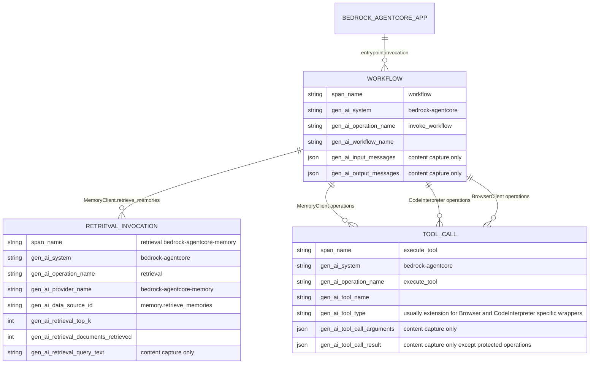

# Bedrock AgentCore Instrumentation Testing Reference

This reference summarizes the current implementation of
`splunk-otel-instrumentation-bedrock-agentcore` for test planning and validation.
It is based on the package wrappers and tests in this repository.

## Scope

The instrumentor wraps selected `bedrock-agentcore` SDK methods with `wrapt` and
emits GenAI telemetry through `splunk-otel-util-genai`.

Package entry point:

```python
from opentelemetry.instrumentation.bedrock_agentcore import (
    BedrockAgentCoreInstrumentor,
)

BedrockAgentCoreInstrumentor().instrument()
```

Zero-code entry point:

```bash
opentelemetry-instrument python your_bedrock_agentcore_app.py
```

Dependency surface:

| Item | Value |
| --- | --- |
| Package | `splunk-otel-instrumentation-bedrock-agentcore` |
| Instrumentation module | `opentelemetry.instrumentation.bedrock_agentcore` |
| OTel instrumentor entry point | `bedrock_agentcore` |
| AgentCore dependency | `bedrock-agentcore >= 1.0.0` |
| Python | `>=3.10` |

## Configuration Reference

| Variable | Default | Accepted values | Testing notes |
| --- | --- | --- | --- |
| `OTEL_INSTRUMENTATION_GENAI_ENABLE` | `true` | Exactly `true`, case-insensitive, enables instrumentation. Any other value disables it. | Set to `false` to verify no AgentCore wrappers are installed. |
| `OTEL_INSTRUMENTATION_GENAI_CAPTURE_MESSAGE_CONTENT` | `false` | For this package wrapper layer, exactly `true`, case-insensitive, enables capture. Other values such as `1`, `yes`, and `on` are treated as false. | Controls wrapper-side `arguments`, `tool_result`, retrieval query text, and emitter-side workflow input/output message emission. |
| `OTEL_INSTRUMENTATION_GENAI_CAPTURE_MESSAGE_CONTENT_MODE` | Util default | `SPAN_ONLY`, `EVENT_ONLY`, `SPAN_AND_EVENT`, `NONE` in the shared GenAI utility pipeline. | The AgentCore wrappers only read the boolean capture flag above; this mode controls where the shared emitter writes captured content. |
| `OTEL_INSTRUMENTATION_GENAI_EMITTERS` | `span` | `span`, `span_metric`, `span_metric_event`, plus optional extension emitters. | Use `span_metric_event` when validating spans, metrics, and content events together. |
| `OTEL_INSTRUMENTATION_GENAI_EVALS_EVALUATORS` | Evaluator defaults | Evaluator entry point configuration, or `none` in tests. | AgentCore emits workflows, retrievals, and tool calls; LLM evaluation requires an LLM-producing instrumentation in the same trace. |

Typical test environment:

```bash
export OTEL_INSTRUMENTATION_GENAI_ENABLE=true
export OTEL_INSTRUMENTATION_GENAI_EMITTERS=span_metric_event
export OTEL_INSTRUMENTATION_GENAI_CAPTURE_MESSAGE_CONTENT=false
export OTEL_INSTRUMENTATION_GENAI_EVALS_EVALUATORS=none
```

Content-capture test environment:

```bash
export OTEL_INSTRUMENTATION_GENAI_CAPTURE_MESSAGE_CONTENT=true
export OTEL_INSTRUMENTATION_GENAI_CAPTURE_MESSAGE_CONTENT_MODE=SPAN_AND_EVENT
```

## Telemetry Relationship Model



## Wrapped SDK Surface

### Application Entrypoint

| SDK target | GenAI type | Span name | Notes |
| --- | --- | --- | --- |
| `bedrock_agentcore.BedrockAgentCoreApp.entrypoint` | `Workflow` | `workflow <app.name or decorated function name>` | Works for sync and async entrypoint functions. Captures the first bound invocation argument as a user input message when content capture is enabled. Captures non-`None` return values as an assistant output message when content capture is enabled. |

### Memory Client

| SDK target | GenAI type | Span name | Key attributes |
| --- | --- | --- | --- |
| `MemoryClient.retrieve_memories` | `RetrievalInvocation` | `retrieval bedrock-agentcore-memory` | `gen_ai.provider.name=bedrock-agentcore-memory`, `gen_ai.data_source.id=memory.retrieve_memories`, `gen_ai.retrieval.type=bedrock-agentcore-memory`, `gen_ai.retrieval.top_k`, `gen_ai.retrieval.documents_retrieved`; query text only with content capture. |
| `MemoryClient.create_event` | `ToolCall` | `execute_tool memory.create_event` | With content capture, arguments include `memory_id`, `actor_id`, and `session_id`. |
| `MemoryClient.create_blob_event` | `ToolCall` | `execute_tool memory.create_blob_event` | With content capture, arguments include `memory_id`, `actor_id`, and `session_id`. |
| `MemoryClient.list_events` | `ToolCall` | `execute_tool memory.list_events` | With content capture, arguments include `memory_id`. |

Generic MemoryClient operations are also wrapped as `ToolCall` spans named
`execute_tool memory.<method>`.

```text
create_memory, create_memory_and_wait, create_or_get_memory, delete_memory,
delete_memory_and_wait, get_memory_status, list_memories, wait_for_memories,
save_conversation, fork_conversation, get_conversation_tree, get_last_k_turns,
list_branch_events, list_branches, merge_branch_context, process_turn_with_llm,
add_strategy, add_episodic_strategy, add_episodic_strategy_and_wait,
add_semantic_strategy, add_semantic_strategy_and_wait, add_summary_strategy,
add_summary_strategy_and_wait, add_user_preference_strategy,
add_user_preference_strategy_and_wait, add_custom_episodic_strategy,
add_custom_episodic_strategy_and_wait, add_custom_semantic_strategy,
add_custom_semantic_strategy_and_wait, delete_strategy, modify_strategy,
get_memory_strategies, update_memory_strategies,
update_memory_strategies_and_wait
```

### Code Interpreter

| SDK target | GenAI type | Span name | Key attributes and capture behavior |
| --- | --- | --- | --- |
| `CodeInterpreter.start` | `ToolCall` | `execute_tool code_interpreter.start` | `bedrock.agentcore.tool.type=code_interpreter`, `bedrock.agentcore.code_interpreter.operation=start_session`; enriches `bedrock.agentcore.code_interpreter.session_id` after the SDK call if available. |
| `CodeInterpreter.stop` | `ToolCall` | `execute_tool code_interpreter.stop` | Adds `operation=stop_session` and existing `session_id` when available. |
| `CodeInterpreter.execute_code` | `ToolCall` | `execute_tool code_interpreter.execute` | `tool_type=extension`; with content capture, stores the first 500 chars of code and first 1000 chars of output. Always sets `bedrock.agentcore.code_interpreter.has_errors=true` when result contains errors. |
| `CodeInterpreter.install_packages` | `ToolCall` | `execute_tool code_interpreter.install_packages` | Always sets `package_count`; package names and result require content capture. |
| `CodeInterpreter.upload_file` | `ToolCall` | `execute_tool code_interpreter.upload_file` | Always sets `file_count=1` and filename metadata from `path` or `filename`. Arguments/result require content capture. |
| `CodeInterpreter.upload_files` | `ToolCall` | `execute_tool code_interpreter.upload_files` | Always sets file count. Arguments/result require content capture. |
| `CodeInterpreter.download_file` | `ToolCall` | `execute_tool code_interpreter.download_file` | Captures arguments only when enabled. Never captures `tool_result` because the result can be raw file content. |
| `CodeInterpreter.download_files` | `ToolCall` | `execute_tool code_interpreter.download_files` | Captures arguments only when enabled. Never captures `tool_result` because the result can be raw file content. |
| `CodeInterpreter.execute_command` | `ToolCall` | `execute_tool code_interpreter.execute_command` | Captures command only when enabled. Never captures `tool_result` because stdout/stderr can be sensitive. |
| `CodeInterpreter.clear_context` | `ToolCall` | `execute_tool code_interpreter.clear_context` | Never captures `tool_result` because context cleanup responses may include state details. |
| `CodeInterpreter.create_code_interpreter` | `ToolCall` | `execute_tool code_interpreter.create_code_interpreter` | With content capture, arguments include name and description. |

Generic CodeInterpreter operations are also wrapped as `ToolCall` spans named
`execute_tool code_interpreter.<method>`:

```text
get_session, list_sessions, delete_code_interpreter, get_code_interpreter,
list_code_interpreters
```

### Browser Client

| SDK target | GenAI type | Span name | Key attributes and capture behavior |
| --- | --- | --- | --- |
| `BrowserClient.start` | `ToolCall` | `execute_tool browser.start` | `tool_type=extension`, `bedrock.agentcore.tool.type=browser`, `operation=start_session`; sets `browser.id` from `browser_id` and enriches `session_id` after the SDK call if available. |
| `BrowserClient.stop` | `ToolCall` | `execute_tool browser.stop` | Adds `operation=stop_session` and existing `session_id` when available. |
| `BrowserClient.take_control` | `ToolCall` | `execute_tool browser.take_control` | Adds `operation=take_control` and existing `session_id` when available. |
| `BrowserClient.release_control` | `ToolCall` | `execute_tool browser.release_control` | Adds `operation=release_control` and existing `session_id` when available. |
| `BrowserClient.get_session` | `ToolCall` | `execute_tool browser.get_session` | Adds `operation=get_session`; enriches `bedrock.agentcore.browser.session_status` from `sessionStatus` when returned. |
| `BrowserClient.generate_ws_headers` | `ToolCall` | `execute_tool browser.generate_ws_headers` | Never captures `tool_result` because the result contains auth credentials. |
| `BrowserClient.generate_live_view_url` | `ToolCall` | `execute_tool browser.generate_live_view_url` | Never captures `tool_result` because the result can contain presigned URL tokens. |

Generic BrowserClient operations are also wrapped as `ToolCall` spans named
`execute_tool browser.<method>`:

```text
list_sessions, create_browser, delete_browser, get_browser, list_browsers,
update_stream
```

## Attribute Assertions

Every AgentCore span should include:

| Attribute | Expected value |
| --- | --- |
| `gen_ai.system` | `bedrock-agentcore` |
| `gen_ai.operation.name` | `invoke_workflow`, `retrieval`, or `execute_tool` |

Tool call spans should include:

| Attribute | Expected value |
| --- | --- |
| `gen_ai.tool.name` | The wrapper tool name, such as `memory.create_event`, `code_interpreter.execute`, or `browser.start`. |
| `gen_ai.tool.type` | `extension` for specific Browser and CodeInterpreter wrappers that set it. Generic wrappers may omit it. |
| `bedrock.agentcore.tool.type` | `browser` or `code_interpreter` for Browser and CodeInterpreter specific wrappers. |

Content-gated attributes:

| Attribute | Emitted when |
| --- | --- |
| `gen_ai.input.messages` | Workflow input capture is enabled and the entrypoint invocation has a bound argument. |
| `gen_ai.output.messages` | Workflow output capture is enabled and the entrypoint returns a non-`None` value. |
| `gen_ai.retrieval.query.text` | Retrieval query capture is enabled. |
| `gen_ai.tool.call.arguments` | Tool argument capture is enabled and the wrapper permits argument capture. |
| `gen_ai.tool.call.result` | Tool result capture is enabled and the wrapper permits result capture. |

Protected-result operations intentionally suppress result capture even when
content capture is enabled:

```text
CodeInterpreter.download_file
CodeInterpreter.download_files
CodeInterpreter.execute_command
CodeInterpreter.clear_context
BrowserClient.generate_ws_headers
BrowserClient.generate_live_view_url
```

## Error Behavior

When the wrapped SDK method raises:

1. The wrapper calls the matching `fail_*` method on `TelemetryHandler`.
2. The span is ended with error status by the shared span emitter.
3. `error.type` is set from the exception type.
4. The original exception is re-raised.
5. Error messages are truncated to 256 characters before being attached to the
   GenAI error object.

If wrapper argument binding or telemetry object construction fails before the SDK
call, the wrapper falls back to calling the original SDK method without telemetry.
The instrumentation should not break AgentCore execution because a wrapper could
not inspect the call.

## Suggested Test Matrix

| Area | Test case | Expected result |
| --- | --- | --- |
| Instrumentor lifecycle | `instrument()` then `uninstrument()` then `instrument()` | No duplicate target inventory; all wrap targets also unwrap. |
| Disable flag | `OTEL_INSTRUMENTATION_GENAI_ENABLE=false` before `instrument()` | No wrapper installation. |
| Content disabled | Default environment | Spans exist, safe metadata exists, content fields are absent. |
| Content enabled | `OTEL_INSTRUMENTATION_GENAI_CAPTURE_MESSAGE_CONTENT=true` | Arguments/results appear except protected operations. |
| Entrypoint sync | Sync `@app.entrypoint` handler | One workflow starts/stops; input and output messages appear with content capture. |
| Entrypoint async | Async `@app.entrypoint` handler | One workflow starts/stops around awaited function. |
| Memory retrieval | `retrieve_memories(..., top_k=N)` | Retrieval span has provider, data source, `top_k`, and document count. |
| Memory errors | Wrapped memory method raises | Span fails and original exception propagates. |
| Code interpreter errors | `execute_code` returns errors | `bedrock.agentcore.code_interpreter.has_errors=true`; result content only when enabled. |
| Browser session lookup | `get_session` returns `sessionStatus` | `bedrock.agentcore.browser.session_status` is set. |
| Sensitive results | Protected operations with capture enabled | No `gen_ai.tool.call.result` is emitted. |

## Known Boundaries

- This package does not wrap Bedrock model runtime calls such as
  `bedrock-runtime.converse`. Combine it with Bedrock, botocore, Strands,
  LangChain, or another provider/framework instrumentation when testing full
  model-call traces.
- AgentCore Memory retrieval is represented as `RetrievalInvocation`; other
  Memory, Browser, and Code Interpreter methods are represented as `ToolCall`.
- Generic wrapper methods capture all inspectable bound arguments only when
  content capture is enabled. Specific wrappers may capture a reduced argument
  set to avoid high-volume or sensitive data.
- Only the exact string `true`, case-insensitive, enables AgentCore wrapper-layer
  content capture. This differs from the shared GenAI utility's broader truthy
  parsing for emitter-level content settings.
