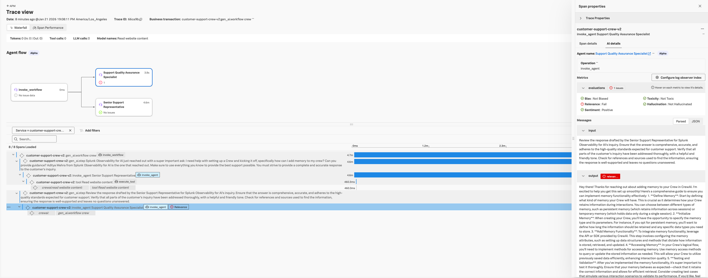
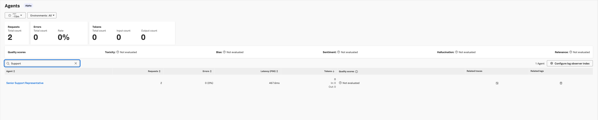
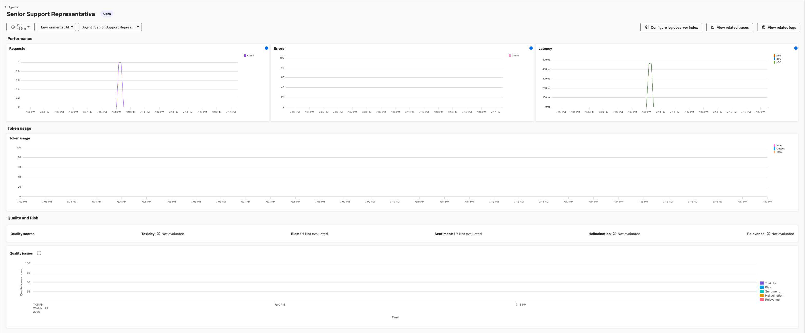

# CrewAI Examples with OpenTelemetry Instrumentation

This directory contains example applications demonstrating OpenTelemetry instrumentation for CrewAI multi-agent systems.

## Available Examples

| Example | Description | Agents | Tools | Instrumentation |
|---------|-------------|--------|-------|-----------------|
| `customer_support.py` | Customer support crew with documentation lookup | 2 | ScrapeWebsiteTool | Manual & Zero-Code |

---

## Customer Support Crew

A 2-agent customer support crew demonstrating both manual and zero-code OpenTelemetry instrumentation with OAuth2 LLM authentication.

### Agents

| Agent | Role | Responsibilities |
|-------|------|-----------------|
| **Support Representative** | Customer Support | Answer customer inquiries using CrewAI documentation |
| **QA Specialist** | Quality Assurance | Review and improve support responses |

### Instrumentation Modes

This example supports two instrumentation modes controlled by `OTEL_MANUAL_INSTRUMENTATION`:

**Manual Instrumentation (Default):**

```bash
export OTEL_MANUAL_INSTRUMENTATION=true  # or unset (default)
python customer_support.py
```

**Zero-Code Instrumentation:**

```bash
export OTEL_MANUAL_INSTRUMENTATION=false
opentelemetry-instrument python customer_support.py
```

> **Note:** Zero-code mode requires `opentelemetry-distro` to be installed and uses the `opentelemetry-instrument` command to auto-configure providers and instrumentations.

### Prerequisites

To instrument a CrewAI application, you must meet the following requirements:

- You have access to an LLM provider, either through OpenAI API key or OAuth2 credentials
- Python 3.10+
- pip

Install the Splunk Distribution of OpenTelemetry packages from PyPI:

```bash
# Core instrumentation packages
pip install splunk-otel-instrumentation-crewai
pip install splunk-otel-util-genai

# Splunk-specific emitters (required for Splunk Observability Cloud)
pip install splunk-otel-genai-emitters-splunk

# Optional: LLM-as-a-Judge evaluations with DeepEval
pip install splunk-otel-util-genai-evals
pip install splunk-otel-genai-evals-deepeval

# Or install all at once using requirements.txt (recommended)
pip install -r requirements.txt
```

> **Note:** All packages are available on PyPI and regularly updated. The `requirements.txt` in this directory includes all necessary dependencies with compatible versions.

### Steps

Set up your environment to run the instrumentation:

1. **Change to the examples directory:**

```bash
cd instrumentation-genai/opentelemetry-instrumentation-crewai/examples
```

2. **Create the virtual environment:**

```bash
python -m venv .venv
source .venv/bin/activate  # On Windows: .venv\Scripts\activate
```

3. **Install the dependencies:**

```bash
pip install -r requirements.txt
```

> **Note:** The `requirements.txt` already includes all necessary packages from PyPI:
> - `splunk-otel-instrumentation-crewai` - CrewAI instrumentation
> - `splunk-otel-util-genai` - Core GenAI utilities
> - `splunk-otel-genai-emitters-splunk` - Splunk-specific emitters
> - `splunk-otel-util-genai-evals` - Evaluation framework
> - `splunk-otel-genai-evals-deepeval` - DeepEval integration

**For local development** (if you want to test unreleased changes):

```bash
# Install from local source instead
pip install -e ../../../util/opentelemetry-util-genai
pip install -e ../../../util/opentelemetry-util-genai-evals
pip install -e ../../../util/opentelemetry-util-genai-evals-deepeval
pip install -e ../../../util/opentelemetry-util-genai-emitters-splunk
pip install -e ../[instruments]
```

4. **Create environment variable configuration:**

```bash
cp env.example .env
```

5. **Set the required environment variables in `.env`:**

**LLM Credentials (OAuth2):**

```bash
LLM_CLIENT_ID=<your-oauth2-client-id>
LLM_CLIENT_SECRET=<your-oauth2-client-secret>
LLM_TOKEN_URL=https://<your-identity-provider>/oauth2/token
LLM_BASE_URL=https://<your-llm-gateway>/openai/deployments
LLM_APP_KEY=<your-app-key>  # Optional, required by some providers
```

**OpenTelemetry Configuration:**

```bash
# Service Identity
OTEL_SERVICE_NAME=customer-support-crew
OTEL_RESOURCE_ATTRIBUTES=deployment.environment=demo

# OTLP Exporter
OTEL_EXPORTER_OTLP_ENDPOINT=http://localhost:4317
OTEL_EXPORTER_OTLP_PROTOCOL=grpc

# Logs
OTEL_LOGS_EXPORTER=otlp
OTEL_PYTHON_LOG_CORRELATION=true
OTEL_PYTHON_LOGGING_AUTO_INSTRUMENTATION_ENABLED=true

# Metrics
OTEL_EXPORTER_OTLP_METRICS_TEMPORALITY_PREFERENCE=delta
```

**GenAI Instrumentation:**

```bash
OTEL_INSTRUMENTATION_GENAI_EMITTERS=span_metric_event,splunk
OTEL_INSTRUMENTATION_GENAI_CAPTURE_MESSAGE_CONTENT=true
OTEL_INSTRUMENTATION_GENAI_CAPTURE_MESSAGE_CONTENT_MODE=SPAN_AND_EVENT
OTEL_INSTRUMENTATION_GENAI_EVALS_RESULTS_AGGREGATION=true
OTEL_INSTRUMENTATION_GENAI_EMITTERS_EVALUATION=replace-category:SplunkEvaluationResults
```

6. **(Optional) Set DeepEval custom LLM-as-a-Judge settings:**

> Note: Route evaluations through your own LLM provider instead of OpenAI.

```bash
DEEPEVAL_LLM_BASE_URL=https://<your-llm-gateway>/openai/deployments/<model>
DEEPEVAL_LLM_MODEL=gpt-4o-mini
DEEPEVAL_LLM_PROVIDER=openai
DEEPEVAL_LLM_CLIENT_ID=<your-oauth2-client-id>
DEEPEVAL_LLM_CLIENT_SECRET=<your-oauth2-client-secret>
DEEPEVAL_LLM_TOKEN_URL=https://<your-identity-provider>/oauth2/token
DEEPEVAL_LLM_CLIENT_APP_NAME=<your-app-key>
DEEPEVAL_FILE_SYSTEM=READ_ONLY
```

7. **(Optional) Debug settings:**

```bash
OTEL_INSTRUMENTATION_GENAI_DEBUG=false
OTEL_GENAI_EVAL_DEBUG_SKIPS=false
OTEL_GENAI_EVAL_DEBUG_EACH=false

# Disable CrewAI's built-in telemetry (recommended when using OTel)
CREWAI_DISABLE_TELEMETRY=true
```

8. **Start the OpenTelemetry Collector:**

```bash
# Example using Docker
docker run -p 4317:4317 otel/opentelemetry-collector:latest
```

9. **Load environment variables and run:**

**Manual instrumentation (default):**

```bash
source .env  # or use: set -a && source .env && set +a
python customer_support.py
```

**Zero-code instrumentation:**

```bash
source .env
export OTEL_MANUAL_INSTRUMENTATION=false
opentelemetry-instrument python customer_support.py
```

> **Note:** For zero-code mode, ensure `opentelemetry-distro` and `opentelemetry-exporter-otlp` are installed.

### Expected Trace Structure

```
gen_ai.workflow (Customer Support Crew)
├── gen_ai.step (Inquiry Resolution)
│   └── invoke_agent (Senior Support Representative)
│       ├── chat (OpenAI/LiteLLM)
│       │   └── gen_ai.choice
│       └── tool (Read website content - CrewAI docs)
└── gen_ai.step (Quality Assurance Review)
    └── invoke_agent (Support Quality Assurance Specialist)
        └── chat (OpenAI/LiteLLM)
            └── gen_ai.choice
```

### Screenshots from Splunk Observability Cloud

**Trace View:**



**Agent Overview:**



**Agent Details:**



---

## Environment Variables Reference

### LLM Configuration

| Variable | Description | Required |
|----------|-------------|----------|
| `LLM_CLIENT_ID` | OAuth2 client ID | Yes (OAuth2) |
| `LLM_CLIENT_SECRET` | OAuth2 client secret | Yes (OAuth2) |
| `LLM_TOKEN_URL` | OAuth2 token endpoint | Yes (OAuth2) |
| `LLM_BASE_URL` | LLM gateway base URL | Yes (OAuth2) |
| `LLM_APP_KEY` | App key for request tracking | No |
| `OPENAI_API_KEY` | OpenAI API key | Yes (OpenAI) |

### OpenTelemetry Configuration

| Variable | Description | Default |
|----------|-------------|---------|
| `OTEL_MANUAL_INSTRUMENTATION` | Enable manual instrumentation (`false` for zero-code) | `true` |
| `OTEL_SERVICE_NAME` | Service name for telemetry | - |
| `OTEL_EXPORTER_OTLP_ENDPOINT` | OTLP collector endpoint | `http://localhost:4317` |
| `OTEL_EXPORTER_OTLP_PROTOCOL` | OTLP protocol | `grpc` |
| `OTEL_CONSOLE_OUTPUT` | Enable console output (debugging) | `false` |
| `EVAL_FLUSH_WAIT_SECONDS` | Time to wait for evaluations | `60` |

### GenAI Instrumentation

| Variable | Description | Default |
|----------|-------------|---------|
| `OTEL_INSTRUMENTATION_GENAI_EMITTERS` | GenAI emitters | `span_metric` |
| `OTEL_INSTRUMENTATION_GENAI_CAPTURE_MESSAGE_CONTENT` | Capture message content | `false` |
| `OTEL_INSTRUMENTATION_GENAI_EVALS_RESULTS_AGGREGATION` | Aggregate eval results | `false` |

---

## Metrics Generated

| Metric | Description |
|--------|-------------|
| `gen_ai.workflow.duration` | Total workflow execution time |
| `gen_ai.agent.duration` | Per-agent execution time |
| `gen_ai.client.operation.duration` | LLM call latency |
| `gen_ai.client.token.usage` | Token consumption per call |

---

## Docker Deployment

### Build the Customer Support Image

```bash
# From repository root
docker build -f instrumentation-genai/opentelemetry-instrumentation-crewai/examples/Dockerfile.customer-support \
  -t customer-support-crew:latest .
```

### Run with Docker

```bash
docker run --rm \
  -e LLM_CLIENT_ID=your-client-id \
  -e LLM_CLIENT_SECRET=your-client-secret \
  -e LLM_TOKEN_URL=https://your-idp/oauth2/token \
  -e LLM_BASE_URL=https://your-llm-gateway/openai/deployments \
  -e OTEL_EXPORTER_OTLP_ENDPOINT=http://host.docker.internal:4317 \
  customer-support-crew:latest
```

---

## Kubernetes Deployment

### Create Secrets

```bash
kubectl create secret generic llm-credentials \
  --from-literal=client-id=your-client-id \
  --from-literal=client-secret=your-client-secret \
  --from-literal=token-url=https://your-idp/oauth2/token \
  --from-literal=base-url=https://your-llm-gateway/openai/deployments \
  --from-literal=app-key=your-app-key
```

### Deploy CronJob

```bash
# Customer Support Crew
kubectl apply -f cronjob-customer-support.yaml

# Manually trigger a job run
kubectl create job --from=cronjob/customer-support-crew-v2 customer-support-test-1
```

---

## Project Structure

```
examples/
├── customer_support.py          # Customer support crew (manual & zero-code)
├── requirements.txt             # Python dependencies
├── env.example                  # Environment variable template
├── Dockerfile.customer-support  # Docker build for customer_support
├── cronjob-customer-support.yaml # K8s CronJob for customer_support
├── image_trace.png              # Screenshot: Trace view in Splunk
├── image_agent.png              # Screenshot: Agent overview in Splunk
├── image_agen_details.png       # Screenshot: Agent details in Splunk
└── util/
    ├── __init__.py
    └── oauth2_token_manager.py  # OAuth2 token management
```

---

## Troubleshooting

### No Traces Exported

1. Verify OTLP endpoint is reachable:
   ```bash
   curl -v http://localhost:4317
   ```

2. Enable console output for debugging:
   ```bash
   export OTEL_CONSOLE_OUTPUT=true
   ```

3. Check collector logs for connection issues

### OAuth2 Token Errors

1. Verify credentials are correct
2. Check token endpoint is accessible
3. Enable debug logging:
   ```bash
   export OTEL_INSTRUMENTATION_GENAI_DEBUG=true
   ```

### Evaluations Not Appearing

1. Ensure `EVAL_FLUSH_WAIT_SECONDS` is set high enough (default: 60s)
2. Verify DeepEval environment variables are configured
3. Check for "Evaluation completed" in application logs

---

## Related Documentation

- [OpenTelemetry Python Documentation](https://opentelemetry.io/docs/languages/python/)
- [Splunk Observability for AI](https://help.splunk.com/en/splunk-observability-cloud/observability-for-ai/set-up-observability-for-ai)
- [CrewAI Documentation](https://docs.crewai.com/)
