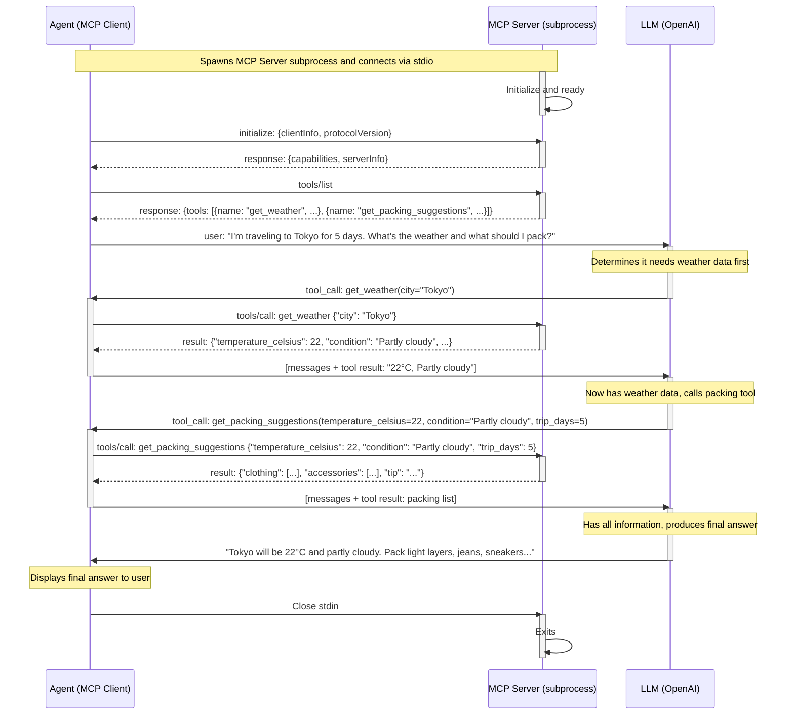

# Weather Agent — MCP + LLM Agentic Loop

This example demonstrates a full agentic loop where an **Agent** (MCP client) orchestrates
between an **MCP Server** (spawned as subprocess) and an **LLM** (OpenAI) to answer weather
and packing questions.

## Sequence Diagram



## Running the Example

### Prerequisites

```bash
pip install openai fastmcp
pip install -e ../../  # Install FastMCP instrumentation
```

Configure credentials and OTLP settings in `.env`:

```bash
source .env
```

---

### stdio mode — server spawned as subprocess

**Manual instrumentation** (`--manual` sets up OTel providers in-process):

```bash
source .env

python weather_agent.py --manual --console          # console output
python weather_agent.py --manual --wait 5           # send to Splunk
python weather_agent.py --manual --query "Weather in London?" --wait 5
```

**Zero-code instrumentation** (`opentelemetry-instrument` auto-configures OTel):

```bash
source .env

opentelemetry-instrument python weather_agent.py
opentelemetry-instrument python weather_agent.py --wait 5
```

---

### HTTP mode — server and agent run as separate processes

**Manual instrumentation:**

```bash
source .env

# Terminal 1: start the server
OTEL_SERVICE_NAME=weather-mcp-server python weather_server.py --manual --transport http

# Terminal 2: run the agent
python weather_agent.py --manual --transport http --wait 5
python weather_agent.py --manual --transport http --query "Weather in Sydney?" --wait 5
```

**Zero-code instrumentation:**

```bash
source .env

# Terminal 1: start the server with opentelemetry-instrument
OTEL_SERVICE_NAME=weather-mcp-server opentelemetry-instrument python weather_server.py --transport http

# Terminal 2: run the agent with opentelemetry-instrument
OTEL_SERVICE_NAME=weather-agent opentelemetry-instrument python weather_agent.py --transport http --wait 5
```

> **Note**: In zero-code mode the `opentelemetry-instrument` wrapper automatically discovers `FastMCPInstrumentor` via the `opentelemetry_instrumentor` entry point. No code changes needed.

---

The agent uses the model configured in `.env` (`OPENAI_MODEL`). Defaults to Azure OpenAI `gpt-4o-mini`.

### What Gets Instrumented

The OpenTelemetry instrumentation captures:

| Span | Description |
|------|-------------|
| `mcp.session` | Full lifecycle of the MCP client session |
| `tools/list` | Tool discovery call |
| `tools/call get_weather` | Individual tool invocation with args/result |
| `tools/call get_packing_suggestions` | Second tool invocation |
| `mcp.server.session.duration` | Server-side session metric |

With `OTEL_INSTRUMENTATION_GENAI_EMITTERS="span_metric"`, you also get:
- `mcp.client.tool.duration` histogram
- `mcp.server.tool.duration` histogram
