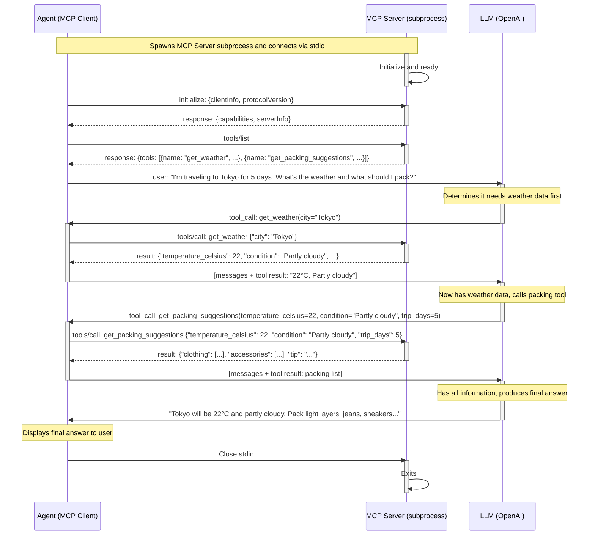

# Weather Agent — MCP + LLM Agentic Loop

This example demonstrates a full agentic loop where an **Agent** (MCP client) orchestrates
between an **MCP Server** (spawned as subprocess) and an **LLM** (OpenAI) to answer weather
and packing questions.

## Sequence Diagram



## Running the Example

### Prerequisites

```bash
pip install openai fastmcp
pip install -e ../../  # Install FastMCP instrumentation
export NVIDIA_API_KEY="nvapi-..."
```

### Quick Start

```bash
# With console trace output
python weather_agent.py --console

# Custom query
python weather_agent.py --query "What's the weather in London and what should I pack for a rainy day?" --console

# With OTLP export (e.g., to Splunk O11y)
export OTEL_EXPORTER_OTLP_ENDPOINT="http://localhost:4317"
export OTEL_INSTRUMENTATION_GENAI_CAPTURE_MESSAGE_CONTENT="true"
python weather_agent.py --wait 10
```

The agent uses **NVIDIA Nemotron** (`nvidia/llama-3.3-nemotron-super-49b-v1`) via the
OpenAI-compatible API at `https://integrate.api.nvidia.com/v1`.

### What Gets Instrumented

The OpenTelemetry instrumentation captures:

| Span | Description |
|------|-------------|
| `mcp.session` | Full lifecycle of the MCP client session |
| `tools/list` | Tool discovery call |
| `tools/call get_weather` | Individual tool invocation with args/result |
| `tools/call get_packing_suggestions` | Second tool invocation |
| `mcp.server.session.duration` | Server-side session metric |

With `OTEL_INSTRUMENTATION_GENAI_EMITTERS="span_metric"`, you also get:
- `mcp.client.tool.duration` histogram
- `mcp.server.tool.duration` histogram
