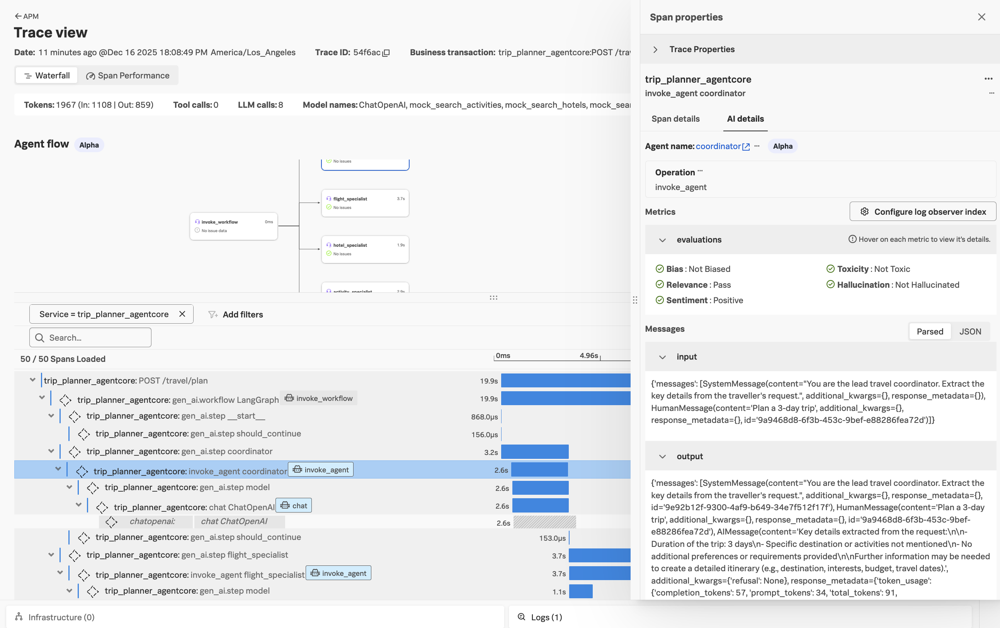

# Deploy LangChain App on Amazon Bedrock AgentCore (OAuth2 Token)

This example demonstrates deploying a LangChain multi-agent travel planner to **Amazon Bedrock AgentCore** with Splunk distro of OpenTelemetry instrumentation sending `traces`, `metrics` and `logs` to **Splunk**.

This version uses **OAuth2 token authentication** for both:
- **LLM calls** - via `OAuth2TokenManager` utility
- **DeepEval evaluations** - via `splunk-otel-genai-evals-deepeval>=0.1.8` with LiteLLM

> **Use Case:** Organizations that use OAuth2-protected LLM endpoints (e.g., Cisco Chat AI, Azure AD, custom GAIT APIs) instead of direct OpenAI API keys.

## What is Amazon Bedrock AgentCore?

[Amazon Bedrock AgentCore](https://docs.aws.amazon.com/bedrock/latest/userguide/agentcore.html) is a managed runtime service for hosting and scaling AI agents on AWS. It's **framework and model agnostic** — you can deploy agents built with LangChain, CrewAI, Strands, or custom frameworks.

## Prerequisites

```bash
# Install AWS CLI and AgentCore CLI
# IMPORTANT: bedrock-agentcore-starter-toolkit >= 0.2.5 is required for file permission fix (PR #407)
pip install awscli bedrock-agentcore>=1.1.1 bedrock-agentcore-starter-toolkit>=0.2.5

# Configure AWS credentials
aws configure

# Verify AgentCore access
agentcore --help
```

> **Note:** Version `bedrock-agentcore-starter-toolkit>=0.2.5` includes a critical fix for file permissions in deployment zips ([PR #407](https://github.com/aws/bedrock-agentcore-starter-toolkit/pull/407)). Earlier versions may cause "Permission denied" errors at runtime.

---

## OAuth2 Authentication Architecture

This example uses OAuth2 client credentials flow for two separate purposes:

```
┌─────────────────────────────────────────────────────────────────────────────┐
│                        OAuth2-Authenticated LLM Calls                        │
├─────────────────────────────────────────────────────────────────────────────┤
│                                                                              │
│  ┌──────────────────┐    OAuth2 Token    ┌──────────────────────────────┐   │
│  │  OAuth2          │  ───────────────►  │  Identity Provider           │   │
│  │  TokenManager    │                    │  (Token Endpoint)            │   │
│  │  (util/)         │  ◄───────────────  │                              │   │
│  └────────┬─────────┘    Access Token    └──────────────────────────────┘   │
│           │                                                                  │
│           ▼                                                                  │
│  ┌──────────────────┐    LLM Request     ┌──────────────────────────────┐   │
│  │  LangChain       │    + Bearer Token  │  LLM Gateway                 │   │
│  │  ChatOpenAI      │  ───────────────►  │  (OpenAI-compatible)         │   │
│  └──────────────────┘                    └──────────────────────────────┘   │
│                                                                              │
├─────────────────────────────────────────────────────────────────────────────┤
│                      OAuth2-Authenticated DeepEval                           │
├─────────────────────────────────────────────────────────────────────────────┤
│                                                                              │
│  ┌──────────────────┐    OAuth2 Token    ┌──────────────────────────────┐   │
│  │  DeepEval        │  ───────────────►  │  Identity Provider           │   │
│  │  LiteLLMModel    │                    │  (Token Endpoint)            │   │
│  │  (via deepeval_  │  ◄───────────────  │                              │   │
│  │   model.py)      │    Access Token    └──────────────────────────────┘   │
│  └────────┬─────────┘                                                       │
│           │                                                                  │
│           ▼                                                                  │
│  ┌──────────────────┐    Eval Request    ┌──────────────────────────────┐   │
│  │  DeepEval        │    + Bearer Token  │  LLM Gateway                 │   │
│  │  Metrics         │  ───────────────►  │  (for evaluation LLM)        │   │
│  └──────────────────┘                    └──────────────────────────────┘   │
│                                                                              │
└─────────────────────────────────────────────────────────────────────────────┘
```

---

## Environment Variables

### LLM OAuth2 Authentication

These variables configure the `OAuth2TokenManager` for LLM calls:

| Variable | Description | Required |
|----------|-------------|----------|
| `LLM_CLIENT_ID` | OAuth2 client ID | Yes |
| `LLM_CLIENT_SECRET` | OAuth2 client secret | Yes |
| `LLM_TOKEN_URL` | OAuth2 token endpoint | Yes |
| `LLM_BASE_URL` | LLM endpoint base URL | Yes |
| `LLM_APP_KEY` | Application key (if required by provider) | Optional |

> **Backward Compatibility:** The `OAuth2TokenManager` also reads legacy `CISCO_*` environment variables for backward compatibility.

### DeepEval Custom LLM Authentication (v0.1.8+)

These variables configure DeepEval to use a custom LLM endpoint for evaluations. Supports both **static API keys** and **OAuth2 tokens**.

| Variable | Description | Required |
|----------|-------------|----------|
| `DEEPEVAL_LLM_BASE_URL` | Evaluation LLM endpoint | Yes (for custom LLM) |
| `DEEPEVAL_LLM_MODEL` | Model name (default: `gpt-4o-mini`) | No |
| `DEEPEVAL_LLM_PROVIDER` | LiteLLM provider prefix (default: `openai`) | No |
| `DEEPEVAL_LLM_API_KEY` | **Static API key** (use this OR OAuth2, not both) | For static auth |
| `DEEPEVAL_LLM_TOKEN_URL` | OAuth2 token endpoint | For OAuth2 auth |
| `DEEPEVAL_LLM_CLIENT_ID` | OAuth2 client ID | For OAuth2 auth |
| `DEEPEVAL_LLM_CLIENT_SECRET` | OAuth2 client secret | For OAuth2 auth |
| `DEEPEVAL_LLM_CLIENT_APP_NAME` | App key for providers that require it | Optional |
| `DEEPEVAL_LLM_AUTH_METHOD` | `basic` (default) or `post` | No |
| `DEEPEVAL_LLM_SCOPE` | OAuth2 scope | Optional |
| `DEEPEVAL_LLM_AUTH_HEADER` | Auth header name (default: `api-key`) | No |
| `DEEPEVAL_LLM_EXTRA_HEADERS` | Custom HTTP headers as JSON (v0.1.8+) | No |

**Authentication Priority:**
1. If `DEEPEVAL_LLM_TOKEN_URL` is set → Uses OAuth2 to obtain token
2. If `DEEPEVAL_LLM_TOKEN_URL` is NOT set → Uses `DEEPEVAL_LLM_API_KEY` as static key
3. If `DEEPEVAL_LLM_BASE_URL` is NOT set → Falls back to `OPENAI_API_KEY`

### Common OTel and DeepEval Variables

| Variable | Description | Recommended Value |
|----------|-------------|-------------------|
| `OTEL_SERVICE_NAME` | Service name in traces | `trip_planner_agentcore` |
| `OTEL_EXPORTER_OTLP_ENDPOINT` | OTel collector endpoint | `http://<collector>:4317` |
| `OTEL_EXPORTER_OTLP_PROTOCOL` | OTLP protocol | `grpc` |
| `OTEL_INSTRUMENTATION_GENAI_EMITTERS` | Enable evals | `span_metric_event,splunk` |
| `DEEPEVAL_FILE_SYSTEM` | Required for AgentCore | `READ_ONLY` |
| `DEEPEVAL_TELEMETRY_OPT_OUT` | Disable DeepEval telemetry | `YES` |
| `HOME` | Writable directory | `/tmp` |
| `EVAL_FLUSH_WAIT_SECONDS` | Wait for eval completion | `300` |

---

## Quick Start

```bash
# Copy to a working directory
cp -R instrumentation-genai/opentelemetry-instrumentation-langchain/examples/multi_agent_travel_planner/agentcore-oauth2-token ~/agentcore-oauth2-token
cd ~/agentcore-oauth2-token
```

### 1. Local Testing

Test the application locally before deploying to AWS:

```bash
# Set environment variables for LLM OAuth2
export LLM_CLIENT_ID=<your-client-id>
export LLM_CLIENT_SECRET=<your-client-secret>
export LLM_TOKEN_URL=<your-oauth2-token-url>
export LLM_BASE_URL=<your-llm-base-url>
export LLM_APP_KEY=<your-app-key>  # Optional

# Set environment variables for DeepEval OAuth2
export DEEPEVAL_LLM_BASE_URL=<your-eval-llm-endpoint>
export DEEPEVAL_LLM_MODEL=gpt-4o-mini
export DEEPEVAL_LLM_PROVIDER=openai
export DEEPEVAL_LLM_CLIENT_ID=<your-client-id>
export DEEPEVAL_LLM_CLIENT_SECRET=<your-client-secret>
export DEEPEVAL_LLM_TOKEN_URL=<your-oauth2-token-url>
export DEEPEVAL_LLM_CLIENT_APP_NAME=<your-app-key>

# OTel configuration for local testing (with otel-tui or local collector)
export OTEL_SERVICE_NAME=trip_planner_local
export OTEL_EXPORTER_OTLP_ENDPOINT=http://localhost:4317
export OTEL_EXPORTER_OTLP_PROTOCOL=grpc
export OTEL_INSTRUMENTATION_GENAI_EMITTERS=span_metric_event,splunk
export EVAL_FLUSH_WAIT_SECONDS=120

# Run locally with AgentCore local server
agentcore deploy --local --force-rebuild-deps

# In another terminal, test the endpoint
curl -X POST http://localhost:8080/invocations \
  -H "Content-Type: application/json" \
  -d '{
    "origin": "San Francisco",
    "destination": "Tokyo",
    "user_request": "Plan a week-long trip with boutique hotels",
    "travellers": 2
  }'
```

### 2. Deploy to AWS AgentCore

```bash
# Configure the agent (creates .bedrock_agentcore.yaml)
agentcore configure -e main.py -n trip_planner_oauth2

# Get OTel Collector NLB endpoint (if using EKS collector)
NLB_DNS=$(kubectl get svc splunk-otel-collector -n splunk-monitoring \
  -o jsonpath='{.status.loadBalancer.ingress[0].hostname}')

# Deploy to AWS with full OAuth2 configuration
agentcore deploy --force-rebuild-deps --auto-update-on-conflict \
  --env LLM_CLIENT_ID=<your-client-id> \
  --env LLM_CLIENT_SECRET=<your-client-secret> \
  --env LLM_TOKEN_URL=<your-oauth2-token-url> \
  --env LLM_BASE_URL=<your-llm-base-url> \
  --env LLM_APP_KEY=<your-app-key> \
  --env DEEPEVAL_LLM_BASE_URL=<your-eval-llm-endpoint>/gpt-4o-mini \
  --env DEEPEVAL_LLM_MODEL=gpt-4o-mini \
  --env DEEPEVAL_LLM_PROVIDER=openai \
  --env DEEPEVAL_LLM_CLIENT_ID=<your-client-id> \
  --env DEEPEVAL_LLM_CLIENT_SECRET=<your-client-secret> \
  --env DEEPEVAL_LLM_TOKEN_URL=<your-oauth2-token-url> \
  --env DEEPEVAL_LLM_CLIENT_APP_NAME=<your-app-key> \
  --env OTEL_EXPORTER_OTLP_ENDPOINT=http://${NLB_DNS}:4317 \
  --env OTEL_EXPORTER_OTLP_PROTOCOL=grpc \
  --env OTEL_EXPORTER_OTLP_METRICS_TEMPORALITY_PREFERENCE=DELTA \
  --env OTEL_SERVICE_NAME=trip_planner_agentcore \
  --env OTEL_RESOURCE_ATTRIBUTES=deployment.environment=aws-agentcore \
  --env OTEL_INSTRUMENTATION_GENAI_EMITTERS=span_metric_event,splunk \
  --env OTEL_INSTRUMENTATION_GENAI_CAPTURE_MESSAGE_CONTENT=true \
  --env OTEL_INSTRUMENTATION_GENAI_CAPTURE_MESSAGE_CONTENT_MODE=SPAN_AND_EVENT \
  --env OTEL_INSTRUMENTATION_GENAI_EVALS_RESULTS_AGGREGATION=true \
  --env OTEL_INSTRUMENTATION_GENAI_EMITTERS_EVALUATION=replace-category:SplunkEvaluationResults \
  --env OTEL_GENAI_EVAL_DEBUG_SKIPS=true \
  --env OTEL_GENAI_EVAL_DEBUG_EACH=false \
  --env DEEPEVAL_PER_ATTEMPT_TIMEOUT_SECONDS_OVERRIDE=300 \
  --env DEEPEVAL_RETRY_MAX_ATTEMPTS=2 \
  --env DEEPEVAL_FILE_SYSTEM=READ_ONLY \
  --env DEEPEVAL_TELEMETRY_OPT_OUT=YES \
  --env CREWAI_DISABLE_TELEMETRY=true \
  --env OTEL_LOGS_EXPORTER=otlp \
  --env OTEL_PYTHON_LOGGING_AUTO_INSTRUMENTATION_ENABLED=true \
  --env DISABLE_ADOT_OBSERVABILITY=true \
  --env HOME=/tmp \
  --env EVAL_FLUSH_WAIT_SECONDS=300
```

### 3. Invoke the Deployed Agent

```bash
# Via AgentCore CLI
agentcore invoke '{"origin": "New York", "destination": "London", "travellers": 3}'
```

**Example Response:**

```json
{
  "status": "success",
  "session_id": "8852f37d-55d0-48c3-9bd7-c5ca01a809d2",
  "origin": "New York",
  "destination": "London",
  "departure": "2026-01-10",
  "return_date": "2026-01-17",
  "travellers": 3,
  "flight_summary": "SkyLine non-stop service, $727 return in Premium Economy",
  "hotel_summary": "The Atlas near historic centre, $293/night with breakfast",
  "activities_summary": "Tower of London, London Eye, British Museum, West End show...",
  "final_itinerary": "### Week-Long Itinerary: New York to London...",
  "agent_steps": [
    {"agent": "coordinator", "status": "completed"},
    {"agent": "flight_specialist", "status": "completed"},
    {"agent": "hotel_specialist", "status": "completed"},
    {"agent": "activity_specialist", "status": "completed"},
    {"agent": "plan_synthesizer", "status": "completed"}
  ]
}
```

**View logs during invocation:**

```bash
# Follow logs in real-time
aws logs tail /aws/bedrock-agentcore/runtimes/<runtime-id>-DEFAULT \
  --log-stream-name-prefix "2025/12/17/[runtime-logs" --follow --region us-west-2

# View last hour of logs
aws logs tail /aws/bedrock-agentcore/runtimes/<runtime-id>-DEFAULT \
  --log-stream-name-prefix "2025/12/17/[runtime-logs" --since 1h --region us-west-2
```

---

## DeepEval OAuth2 Support (v0.1.8+)

The `splunk-otel-genai-evals-deepeval>=0.1.8` package includes built-in support for OAuth2-authenticated LLM providers via LiteLLM.

### How It Works

1. When `DEEPEVAL_LLM_BASE_URL` is set, the package creates a `LiteLLMModel` instance
2. If `DEEPEVAL_LLM_TOKEN_URL` is also set, it uses `OAuth2TokenManager` to obtain tokens
3. Tokens are passed via the configured auth header (default: `api-key`)
4. If OAuth2 is not configured, it falls back to standard `OPENAI_API_KEY`

### Supported OAuth2 Grant Types

| Auth Method | Description | Use Case |
|-------------|-------------|----------|
| `basic` (default) | Client credentials in Basic Auth header | Okta, Cisco Identity |
| `post` | Client credentials in POST body | Azure AD, some enterprise IdPs |

### Example: Static API Key (No OAuth2)

```bash
# Use a static API key - simplest configuration
export DEEPEVAL_LLM_BASE_URL=https://api.your-provider.com/v1
export DEEPEVAL_LLM_MODEL=gpt-4o-mini
export DEEPEVAL_LLM_PROVIDER=openai
export DEEPEVAL_LLM_API_KEY=<your-api-key>
# Note: Do NOT set DEEPEVAL_LLM_TOKEN_URL when using static API key
```

### Example: Dynamic Token Generation (OAuth2)

```bash
export DEEPEVAL_LLM_BASE_URL=https://your-gait-gateway.example.com/v1
export DEEPEVAL_LLM_MODEL=claude-3-5-sonnet-v2@20241022
export DEEPEVAL_LLM_PROVIDER=anthropic
export DEEPEVAL_LLM_CLIENT_ID=<azure-client-id>
export DEEPEVAL_LLM_CLIENT_SECRET=<azure-client-secret>
export DEEPEVAL_LLM_TOKEN_URL=https://login.microsoftonline.com/<tenant>/oauth2/v2.0/token
export DEEPEVAL_LLM_SCOPE=api://<resource>/.default
export DEEPEVAL_LLM_AUTH_METHOD=post
```

### Example: Custom Headers for API Gateways (v0.1.8+)

Some API gateways require custom headers (e.g., `system-code` for Azure OpenAI proxies):

```bash
export DEEPEVAL_LLM_BASE_URL=https://your-azure-proxy.example.com/v1
export DEEPEVAL_LLM_MODEL=gpt-4o-mini
export DEEPEVAL_LLM_API_KEY=<your-api-key>
# Add custom headers as JSON
export DEEPEVAL_LLM_EXTRA_HEADERS='{"system-code": "APP-123", "x-custom-header": "value"}'
```

> **Note:** LiteLLM does not natively support `extra_headers` via environment variables. This feature is provided by `splunk-otel-genai-evals-deepeval>=0.1.8` to enable custom headers for API gateways.

---

## Viewing GenAI Evaluations in Splunk APM

Once the telemetry pipeline is configured correctly, you can view GenAI traces with **evaluation results** directly in Splunk.

### Trace View with Evaluations



The screenshot above shows:

| Feature | Description |
|---------|-------------|
| **Agent Flow** | Visual workflow showing `invoke_workflow` → `flight_specialist`, `activity_specialist`, `hotel_specialist` |
| **Span Properties** | Agent name, operation type, model (`ChatOpenAI`), token counts |
| **Evaluations** | DeepEval results displayed inline: Bias, Toxicity, Relevance, Hallucination, Sentiment |
| **Messages** | Input/output message content captured for each LLM call |

### Evaluation Metrics Displayed

- ✅ **Bias**: Not Biased
- ✅ **Toxicity**: Not Toxic
- ✅ **Relevance**: Pass
- ✅ **Hallucination**: Not Hallucinated
- ✅ **Sentiment**: Positive

---

## Project Structure

```
agentcore-oauth2-token/
├── main.py                  # LangChain travel planner with AgentCore entrypoint
├── requirements.txt         # Python dependencies (includes deepeval v0.1.7+)
├── images/
│   └── image.png            # Screenshot of Splunk APM with evaluations
├── util/
│   ├── __init__.py
│   └── oauth2_token_manager.py  # Generic OAuth2 token management for LLM calls
└── README.md                # This file
```

### Key Components

| File | Purpose |
|------|---------|
| `util/oauth2_token_manager.py` | Generic OAuth2 client credentials flow for LLM authentication |
| `main.py` | LangChain multi-agent workflow with OTel instrumentation |
| `requirements.txt` | Includes `splunk-otel-genai-evals-deepeval>=0.1.8` and `litellm` |

---

## Known Issues

### OAuth2 Token Expiration During Long Evaluations

DeepEval evaluations can take several minutes (especially with multiple metrics). If your OAuth2 token expires during evaluation, you may see 401 errors:

```
AuthenticationError: Error code: 401 - {'fault': {'faultstring': 'Failed to Resolve Variable'}}
```

**Workarounds:**
1. Increase token lifetime on your identity provider
2. Use shorter evaluation timeouts via `DEEPEVAL_PER_ATTEMPT_TIMEOUT_SECONDS_OVERRIDE`
3. Reduce the number of concurrent evaluations

### Network Connectivity for OAuth2

When running in AgentCore VPC mode, ensure your runtime can reach:
- OAuth2 token endpoint (e.g., `id.cisco.com`, `login.microsoftonline.com`)
- LLM gateway endpoint

Configure NAT Gateway or appropriate egress rules for your VPC subnets.

---

## References

- [Amazon Bedrock AgentCore Documentation](https://docs.aws.amazon.com/bedrock/latest/userguide/agentcore.html)
- [AgentCore Samples Repository](https://github.com/awslabs/amazon-bedrock-agentcore-samples)
- [Splunk OTLP Ingest - General](https://help.splunk.com/en/splunk-observability-cloud/manage-data/other-data-ingestion-methods/other-data-ingestion-methods)
- [DeepEval Documentation](https://docs.confident-ai.com/)
- [LiteLLM Custom Provider](https://docs.litellm.ai/docs/providers/custom_provider)
- [OpenTelemetry Python SDK](https://opentelemetry.io/docs/languages/python/)
