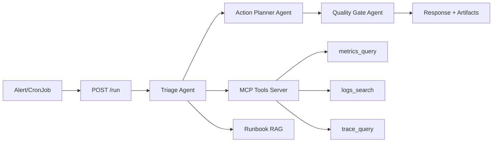

# SRE Incident Copilot

A production-style demo application showcasing GenAI observability capabilities using LangChain/LangGraph with multi-agent orchestration, MCP tools, and evaluation metrics.

## Overview

The SRE Incident Copilot demonstrates an agentic workflow that:

- Investigates alerts using realistic observability tooling (metrics/logs/traces search via MCP)
- Produces actionable incident artifacts (tasks, notifications, postmortem drafts)
- Emits comprehensive OpenTelemetry telemetry for the agent workflow
- Detects model/tool drift with evals and enforces safety gates

## Architecture

### Production Deployment (Kubernetes)

```
┌─────────────────┐     ┌─────────────────┐     ┌─────────────────┐
│   K8s CronJob   │────▶│  SRE Copilot    │─MCP─▶│  MCP Server     │
│   (curl)        │     │  (FastAPI)      │ SSE │  (fastmcp)      │
│                 │     │  Port 8080      │     │  Port 8081      │
└─────────────────┘     └─────────────────┘     └─────────────────┘
                              │
                              ▼
                        ┌─────────────────┐
                        │ OTEL Collector  │
                        │ (DaemonSet)     │
                        └─────────────────┘
```

### Components

| Component | Description | Port |
|-----------|-------------|------|
| **SRE Copilot Server** | FastAPI server handling incident investigations | 8080 |
| **MCP Tools Server** | MCP server (SSE transport) for observability tools | 8081 |
| **OTEL Collector** | Receives telemetry from instrumented services | 4317 |
| **K8s CronJob** | Triggers incident investigations on schedule | - |

### MCP Communication

The SRE Copilot communicates with the MCP Tools Server using the **Model Context Protocol (MCP)** over SSE (Server-Sent Events) transport:

- **Local development**: MCP over stdio (spawns subprocess)
- **Production/K8s**: MCP over SSE/HTTP (connects to remote server)

### Agents

1. **Triage Agent**: Normalizes alerts, identifies affected services, selects investigation plan
2. **Investigation Agent**: Queries metrics/logs/traces, assembles evidence, proposes hypotheses (called as tool)
3. **Action Planner Agent**: Translates hypotheses into mitigation steps and tasks
4. **Quality Gate Agent**: Enforces safety rails, validates outputs, computes eval metrics

### Workflow



## Quick Start

### Local Development

```bash
# 1. Setup
cd instrumentation-genai/opentelemetry-instrumentation-langchain/examples/sre_incident_copilot
python3 -m venv .venv
source .venv/bin/activate
pip install -r requirements.txt

# 2. Set credentials
export OPENAI_API_KEY=sk-your-key

# 3. Run CLI (no instrumentation)
python main.py --scenario scenario-001

# 4. Or run with zero-code instrumentation (recommended)
opentelemetry-instrument python main.py --scenario scenario-001

# 5. Or run with manual instrumentation (configures OTEL providers in code)
python main.py --scenario scenario-001 --manual-instrumentation
```

### Production Mode (Server)

```bash
# Terminal 1: Start MCP Tools Server (SSE transport)
MCP_PORT=8081 python -m mcp_tools.mcp_server

# Terminal 2: Start SRE Copilot Server
export MCP_SERVER_URL=http://localhost:8081
opentelemetry-instrument uvicorn server:app --host 0.0.0.0 --port 8080

# Terminal 3: Call the API
curl -X POST http://localhost:8080/run \
  -H "Content-Type: application/json" \
  -d '{"scenario_id": "scenario-001"}'
```

## API Endpoints

### SRE Copilot Server (port 8080)

| Endpoint | Method | Description |
|----------|--------|-------------|
| `/health` | GET | Health check for K8s probes |
| `/run` | POST | Run an incident investigation |
| `/scenarios` | GET | List available scenarios |

#### POST /run

Request:
```json
{
  "scenario_id": "scenario-001",
  "drift_mode": null,
  "drift_intensity": 0.0
}
```

Response:
```json
{
  "run_id": "scenario-001-20240116-120000",
  "scenario_id": "scenario-001",
  "validation_passed": true,
  "confidence_score": 0.85,
  "artifacts_path": "artifacts/scenario-001-20240116-120000",
  "hypotheses_count": 2,
  "tasks_created": 4
}
```

### MCP Tools Server (port 8081)

| Endpoint | Method | Description |
|----------|--------|-------------|
| `/health` | GET | Health check |
| `/tools/metrics_query` | POST | Query metrics |
| `/tools/logs_search` | POST | Search logs |
| `/tools/trace_query` | POST | Query traces |

## Kubernetes Deployment

### Deploy Services

```yaml
# See k8s-cronjob.yaml for full configuration
kubectl apply -f k8s-cronjob.yaml
```

### Environment Variables

| Variable | Description | Default |
|----------|-------------|---------|
| `MCP_SERVER_URL` | URL of MCP Tools Server | None (uses stdio locally) |
| `OTEL_EXPORTER_OTLP_ENDPOINT` | OTLP collector endpoint | None |
| `OTEL_SERVICE_NAME` | Service name for telemetry | `sre-incident-copilot` |
| `OPENAI_API_KEY` | OpenAI API key | Required |
| `DEBUG_TOOLS` | Enable tool debug output | `0` |

### Example K8s CronJob

```yaml
apiVersion: batch/v1
kind: CronJob
metadata:
  name: sre-copilot-runner
spec:
  schedule: "*/10 * * * *"  # Every 10 minutes
  jobTemplate:
    spec:
      template:
        spec:
          containers:
          - name: runner
            image: curlimages/curl
            command:
            - curl
            - -X
            - POST
            - http://sre-copilot:8080/run
            - -H
            - "Content-Type: application/json"
            - -d
            - '{"scenario_id": "scenario-001"}'
          restartPolicy: OnFailure
```

## Zero-Code Instrumentation

The application supports zero-code OpenTelemetry instrumentation:

```bash
# Install auto-instrumentation
pip install opentelemetry-distro opentelemetry-exporter-otlp

# Run with auto-instrumentation
opentelemetry-instrument \
  --service_name sre-incident-copilot \
  --exporter_otlp_endpoint http://localhost:4317 \
  uvicorn server:app --host 0.0.0.0 --port 8080
```

The `LangchainInstrumentor` is automatically initialized at startup, requiring no manual OTEL configuration.

## Available Scenarios

| ID | Description | Service |
|----|-------------|---------|
| `scenario-001` | Database connection pool exhaustion | payment-service |
| `scenario-002` | Cache miss storm | user-service |
| `scenario-003` | Recent deployment issue | api-gateway |
| `scenario-004` | Database connection pool exhaustion | database-primary |
| `scenario-005` | Redis cache memory pressure | redis-cache |
| `scenario-006` | Authentication service failures | auth-service |
| `scenario-007` | Notification queue depth runaway | notification-service |
| `scenario-008` | Analytics service latency degradation | analytics-service |
| `scenario-009` | Payment service deployment correlation | payment-service |
| `scenario-010` | User service dependency failure | user-service |

## Project Structure

```
sre_incident_copilot/
├── server.py              # FastAPI server (production)
├── main.py                # CLI application (development)
├── agents.py              # Agent implementations
├── tools.py               # LangChain tools (MCP SSE + stdio modes)
├── config.py              # Configuration management
├── validation.py          # Business logic validation
├── mcp_tools/
│   ├── mcp_server.py      # MCP server with SSE transport (production)
│   └── observability_tools.py  # MCP server with stdio transport (development)
├── data/
│   ├── alert_catalog.json
│   ├── service_catalog.json
│   └── runbooks/
└── artifacts/             # Generated artifacts
```

## Development

### Running Tests

```bash
pytest tests/
```

### Adding New Scenarios

1. Add alert to `data/alert_catalog.json`
2. Add seeded data to `mcp_tools/observability_tools.py`
3. Add expected validation to scenario config

## Credentials

### Option 1: OpenAI

```bash
export OPENAI_API_KEY=sk-your-key
export OPENAI_MODEL=gpt-4o-mini  # Optional
```

### Option 2: Circuit + Azure

```bash
# Circuit (all 5 required)
export CIRCUIT_BASE_URL=https://chat-ai.cisco.com/openai/deployments/gpt-4o-mini
export CIRCUIT_TOKEN_URL=https://id.cisco.com/oauth2/default/v1/token
export CIRCUIT_CLIENT_ID=your-client-id
export CIRCUIT_CLIENT_SECRET=your-client-secret
export CIRCUIT_APP_KEY=your-app-key

# Azure (all 4 required)
export AZURE_OPENAI_ENDPOINT=https://your-resource.openai.azure.com/
export AZURE_OPENAI_API_KEY=your-azure-api-key
export AZURE_OPENAI_API_VERSION=2024-02-01
export AZURE_EMBEDDING_DEPLOYMENT=text-embedding-ada-002
```
