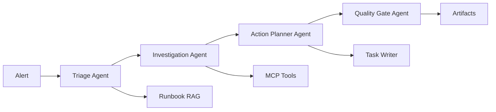

# SRE Incident Copilot

A production-style demo application showcasing GenAI observability capabilities using LangChain/LangGraph with multi-agent orchestration, MCP tools, and evaluation metrics.

## Overview

The SRE Incident Copilot demonstrates an agentic workflow that:

- Investigates alerts using realistic observability tooling (metrics/logs/traces search via MCP)
- Produces actionable incident artifacts (tasks, notifications, postmortem drafts)
- Emits comprehensive OpenTelemetry telemetry for the agent workflow
- Detects model/tool drift with evals and enforces safety gates

## Architecture

### Agents

1. **Triage Agent**: Normalizes alerts, identifies affected services, selects investigation plan
2. **Investigation Agent**: Queries metrics/logs/traces, assembles evidence, proposes hypotheses
3. **Action Planner Agent**: Translates hypotheses into mitigation steps and tasks
4. **Quality Gate Agent**: Enforces safety rails, validates outputs, computes eval metrics

### Tools

- **MCP Tools**: `metrics_query`, `logs_search`, `trace_query` (via MCP server)
- **RAG Tools**: `runbook_search` (vector search over runbooks with citations)
- **Integration Tools**: `service_catalog_lookup`, `task_writer`, `notifier`
- **Agent-as-Tool**: `investigation_agent_mcp` (Investigation Agent exposed as MCP tool)

### Workflow



## Features

- **Multi-Agent Orchestration**: 4 agents working in sequence with LangGraph
- **MCP Tools**: Observability tools exposed via MCP protocol
- **Agent-as-MCP-Tool**: Investigation Agent can be called as an MCP tool
- **RAG with Citations**: Runbook search with vector embeddings and citations
- **Seeded Data**: Deterministic scenarios with consistent telemetry
- **Evaluation Metrics**: DeepEval integration for quality assessment
- **Drift Simulation**: Simulation runner with configurable drift modes
- **K8s Ready**: CronJob configuration for scheduled runs

## Setup

### Prerequisites

- Python 3.11+
- OpenAI API key
- OpenTelemetry collector endpoint (optional)

### Installation

```bash
cd instrumentation-genai/opentelemetry-instrumentation-langchain/examples/sre_incident_copilot
python3 -m venv .venv
source .venv/bin/activate  # On Windows: .venv\Scripts\activate
pip install -r requirements.txt
```

**Important**: Always activate the virtual environment before running the application:

```bash
source .venv/bin/activate  # On Windows: .venv\Scripts\activate
```

### Configuration

Create a `.env` file:

```bash
OPENAI_API_KEY=your-api-key
OPENAI_MODEL=gpt-4o-mini
OTEL_EXPORTER_OTLP_ENDPOINT=http://localhost:4317
OTEL_SERVICE_NAME=sre-incident-copilot
SCENARIO_ID=scenario-001
# Cisco LLM OAuth2
OAUTH_TOKEN_URL=https://your-oauth-endpoint/token
OAUTH_CLIENT_ID=your-client-id
OAUTH_CLIENT_SECRET=your-client-secret
OAUTH_APP_KEY=your-app-key
OPENAI_BASE_URL=https://your-cisco-llm-endpoint

# Azure OpenAI Embeddings
AZURE_OPENAI_ENDPOINT=https://etser-mf7gfr7m-eastus2.cognitiveservices.azure.com/
AZURE_OPENAI_API_KEY=your-api-key
AZURE_OPENAI_API_VERSION=2024-02-01
AZURE_EMBEDDING_DEPLOYMENT=text-embedding-3-large
```

## Usage

### Run a Single Scenario

**Make sure the venv is activated first:**

```bash
source .venv/bin/activate  # On Windows: .venv\Scripts\activate
python main.py --scenario scenario-001
```

### Run with Manual Instrumentation

```bash
python main.py --scenario scenario-001 --manual-instrumentation
```

### Run Simulation with Drift

**Make sure the venv is activated first:**

```bash
source .venv/bin/activate  # On Windows: .venv\Scripts\activate
python simulation_runner.py \
  --scenarios scenario-001 scenario-002 \
  --iterations 10 \
  --drift-mode tool_failure \
  --drift-intensity 0.2
```

### Validation

Validation is performed automatically when running scenarios. The `main.py` script runs business logic validation and displays results. To validate a scenario:

```bash
source .venv/bin/activate  # On Windows: .venv\Scripts\activate
python main.py --scenario scenario-001
```

Validation checks:

- Hypothesis matching (top hypothesis contains expected root cause keywords)
- Evidence sufficiency (collects expected evidence types)
- Action safety (actions are safe given confidence level)

## Available Scenarios

- `scenario-001`: Database connection pool exhaustion
- `scenario-002`: Cache miss storm
- `scenario-003`: Recent deployment issue
- `scenario-004`: Database connection pool exhaustion (different service)
- `scenario-005`: Redis cache memory pressure
- `scenario-006`: Authentication service failures
- `scenario-007`: Notification queue depth runaway
- `scenario-008`: Analytics service latency degradation
- `scenario-009`: Payment service deployment correlation
- `scenario-010`: User service dependency failure

## Outputs

Each run produces artifacts in `artifacts/<run_id>/`:

- `inputs.json`: Input alert and scenario details
- `outputs.json`: Agent outputs and results
- `run_meta.json`: Run metadata and configuration
- `incident_summary.md`: Formatted incident summary
- `postmortem_draft.md`: Postmortem template
- `eval_report.json`: Evaluation metrics and scores

## Kubernetes Deployment

See `k8s-cronjob.yaml` for a complete CronJob configuration. The app runs every 10 minutes by default.

```bash
kubectl apply -f k8s-cronjob.yaml
```

## Development

## Key Files

| File                                   | Purpose                                                    |
| -------------------------------------- | ---------------------------------------------------------- |
| `main.py`                              | Workflow orchestration, artifact generation                |
| `agents.py`                            | Triage, Investigation, Action Planner, Quality Gate agents |
| `tools.py`                             | LangChain tools including MCP tool wrappers                |
| `mcp_tools/observability_tools.py`     | MCP server for metrics/logs/traces                         |
| `mcp_tools/investigation_agent_mcp.py` | Investigation Agent as MCP tool                            |
| `runbook_search.py`                    | RAG implementation for runbook search                      |
| `validation.py`                        | Business logic validation harness                          |
| `simulation_runner.py`                 | Batch simulation with drift modes                          |

## Environment Variables

| Variable                      | Purpose                        | Default                |
| ----------------------------- | ------------------------------ | ---------------------- |
| `OPENAI_API_KEY`              | OpenAI API key                 | Required               |
| `OPENAI_MODEL`                | Model to use                   | `gpt-4o-mini`          |
| `OTEL_SERVICE_NAME`           | Service name for telemetry     | `sre-incident-copilot` |
| `OTEL_EXPORTER_OTLP_ENDPOINT` | OTLP endpoint                  | Optional               |
| `SCENARIO_ID`                 | Scenario to run                | Required               |
| `DATA_DIR`                    | Data directory                 | `data`                 |
| `ARTIFACTS_DIR`               | Artifacts directory            | `artifacts`            |
| `CONFIDENCE_THRESHOLD`        | Minimum confidence for actions | `0.7`                  |
| `EVIDENCE_COUNT_THRESHOLD`    | Minimum evidence pieces        | `3`                    |
