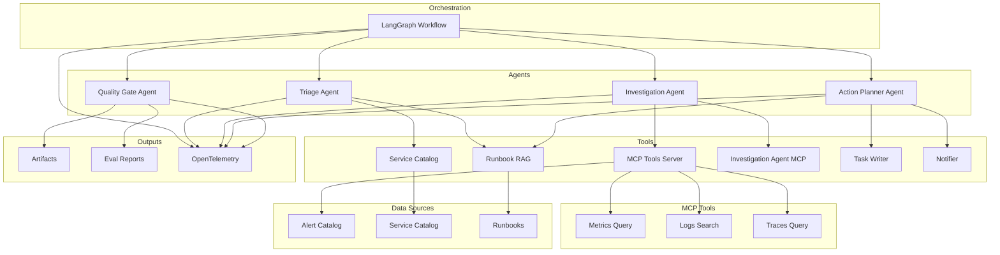
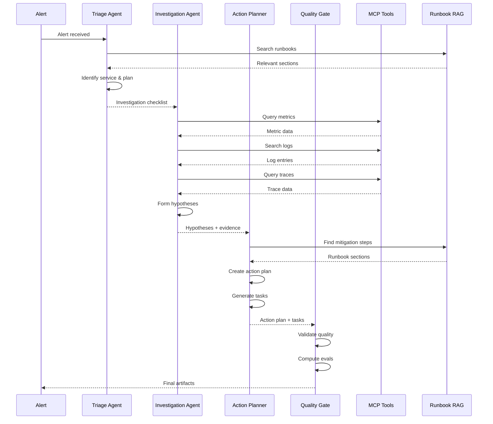

# SRE Incident Copilot - Demo Scenarios

This document describes the SRE Incident Copilot demo application architecture, scenarios, and use cases.

## Overview

The SRE Incident Copilot is a production-style demo that showcases GenAI observability capabilities through an agentic incident response workflow. It demonstrates:

- Multi-agent orchestration (4 agents: Triage, Investigation, Action Planner, Quality Gate)
- MCP tools for observability data (metrics, logs, traces)
- Agent-as-MCP-tool (Investigation Agent exposed as MCP service)
- RAG-based runbook search with citations
- Evaluation metrics and drift detection
- Consistent, seeded telemetry data

## Architecture

### Component Diagram



### Agent Flow



## Agents

### 1. Triage Agent

**Purpose**: Normalize alerts, identify affected services, create investigation plan

**Tools**:
- `service_catalog_lookup`: Get service details
- `runbook_search`: Find relevant runbooks

**Outputs**:
- Service identification
- Investigation checklist
- Relevant runbook references

**Example Output**:
```json
{
  "service_id": "payment-service",
  "service_info": {...},
  "investigation_checklist": [
    "Check error rate metrics",
    "Search logs for connection errors",
    "Query traces for slow operations"
  ],
  "relevant_runbooks": ["database_connection_pool_exhaustion"]
}
```

### 2. Investigation Agent

**Purpose**: Query observability data, assemble evidence, propose hypotheses

**Tools**:
- `metrics_query`: Query metrics (via MCP)
- `logs_search`: Search logs (via MCP)
- `trace_query`: Query traces (via MCP)
- `investigation_agent_mcp`: Call Investigation Agent as MCP tool (optional)

**Outputs**:
- Multiple hypotheses with confidence scores
- Evidence with citations (query results, log entries, trace IDs)
- Evidence types (metrics, logs, traces)

**Example Output**:
```json
{
  "hypotheses": [
    {
      "hypothesis": "Database connection pool exhausted",
      "confidence": 0.85,
      "evidence": [
        {"type": "metrics", "source": "metrics_query", "citation": "active_connections: 100/100"},
        {"type": "logs", "source": "logs_search", "citation": "Connection timeout after 30s"},
        {"type": "traces", "source": "trace_query", "citation": "trace-001: db.connection.wait_time_ms: 30000"}
      ],
      "evidence_types": ["metrics", "logs", "traces"]
    }
  ],
  "evidence_summary": "3 metrics queries, 5 log entries, 2 traces analyzed"
}
```

### 3. Action Planner Agent

**Purpose**: Translate hypotheses into actionable steps and tasks

**Tools**:
- `runbook_search`: Find mitigation steps
- `task_writer`: Create tasks/tickets
- `notifier`: Draft team communications

**Outputs**:
- Ranked mitigation plan
- Rollback plan (if needed)
- Created tasks
- Communication draft
- Runbook citations

**Example Output**:
```json
{
  "selected_hypothesis": "Database connection pool exhausted",
  "mitigation_plan": [
    "Restart connection pool (if safe)",
    "Scale up database connections temporarily",
    "Identify and fix connection leaks"
  ],
  "rollback_plan": ["Revert pool size changes if issues occur"],
  "tasks": [
    {"title": "Restart payment-service connection pool", "priority": "high"},
    {"title": "Investigate connection leaks", "priority": "medium"}
  ],
  "communication_draft": "Incident: Payment service experiencing connection pool exhaustion...",
  "runbook_references": ["runbook:database_connection_pool_exhaustion#chunk-0"]
}
```

### 4. Quality Gate Agent

**Purpose**: Enforce safety rails, validate outputs, check business logic

**Tools**: None (validation only)

**Outputs**:
- Validation results
- Confidence and evidence checks
- Action safety assessment
- Writeback permission
- Approval request (if required)

**Example Output**:
```json
{
  "validation_passed": true,
  "confidence_check": true,
  "evidence_check": true,
  "action_safety": true,
  "writeback_allowed": true,
  "approval_requested": false,
  "confidence_score": 0.85
}
```

**Note**: Evaluation metrics (bias, toxicity, relevance, etc.) are automatically emitted as OpenTelemetry metrics/logs by the `opentelemetry-util-genai-evals` package. The Quality Gate Agent performs business logic validation only.

## MCP Tools

### Observability Tools MCP Server

The `observability_tools.py` MCP server exposes:

1. **metrics_query**: Query metrics for a service
   - Parameters: `service_id`, `metric_name`, `time_window`, `scenario_id`
   - Returns: Time series data with timestamps and values

2. **logs_search**: Search logs for a service
   - Parameters: `service_id`, `query`, `time_window`, `limit`, `scenario_id`
   - Returns: Matching log entries with metadata

3. **trace_query**: Query traces for a service
   - Parameters: `service_id`, `operation`, `time_window`, `limit`, `scenario_id`
   - Returns: Trace data with spans and attributes

### Investigation Agent MCP Server

The `investigation_agent_mcp.py` MCP server exposes:

1. **investigate_incident**: Call Investigation Agent as a tool
   - Parameters: `service_id`, `investigation_checklist`, `scenario_id`
   - Returns: Investigation results with hypotheses and evidence

This demonstrates **agent-as-MCP-tool** pattern where an agent can be invoked as a service by other agents or external systems.

## Scenarios

### Scenario 001: Database Connection Pool Exhaustion

**Alert**: Payment Service Error Rate Spike
- Service: `payment-service`
- Expected Root Cause: `database_connection_pool_exhaustion`
- Evidence Types: metrics, logs, traces

**Investigation Flow**:
1. Triage identifies payment-service and finds relevant runbook
2. Investigation queries metrics (active_connections: 100/100)
3. Investigation searches logs (connection timeout errors)
4. Investigation queries traces (long wait times)
5. Action Planner creates mitigation tasks
6. Quality Gate validates and allows writeback

### Scenario 002: Cache Miss Storm

**Alert**: User Service Latency Spike
- Service: `user-service`
- Expected Root Cause: `cache_miss_storm`
- Evidence Types: metrics, logs

**Investigation Flow**:
1. Triage identifies user-service
2. Investigation queries latency metrics (P95: 850ms)
3. Investigation queries cache hit rate (dropped to 12%)
4. Action Planner recommends cache warming
5. Quality Gate validates based on evidence

### Scenario 003: Recent Deployment Issue

**Alert**: API Gateway Error Rate Critical
- Service: `api-gateway`
- Expected Root Cause: `recent_deployment_issue`
- Evidence Types: metrics, logs, traces

**Investigation Flow**:
1. Triage correlates with recent deployment
2. Investigation queries error rates before/after deployment
3. Investigation searches for new error types
4. Action Planner recommends rollback
5. Quality Gate requires approval (high severity)

### Scenario 004: Connection Leak

**Alert**: Database Connection Pool Exhausted
- Service: `database-primary`
- Expected Root Cause: `connection_leak`
- Evidence Types: metrics, logs

**Investigation Flow**:
1. Triage identifies database-primary service
2. Investigation queries connection pool usage metrics
3. Investigation searches logs for connection errors
4. Action Planner recommends restarting connections and investigating leaks
5. Quality Gate requires approval (high severity)

### Scenario 005: Cache Key Explosion

**Alert**: Redis Cache Memory Pressure
- Service: `redis-cache`
- Expected Root Cause: `cache_key_explosion`
- Evidence Types: metrics

**Investigation Flow**:
1. Triage identifies redis-cache service
2. Investigation queries memory usage and eviction metrics
3. Action Planner recommends clearing cache keys and scaling
4. Quality Gate validates based on metrics evidence

### Scenario 006: Token Validation Issue

**Alert**: Authentication Service High Failure Rate
- Service: `auth-service`
- Expected Root Cause: `token_validation_issue`
- Evidence Types: metrics, logs, traces

**Investigation Flow**:
1. Triage identifies auth-service
2. Investigation queries authentication failure rate and token validation errors
3. Investigation searches logs for token validation failures
4. Investigation queries traces for validation operations
5. Action Planner recommends restarting service and investigating token issues
6. Quality Gate validates based on evidence

### Scenario 007: Downstream Service Degradation

**Alert**: Notification Queue Depth Runaway
- Service: `notification-service`
- Expected Root Cause: `downstream_service_degradation`
- Evidence Types: metrics, logs

**Investigation Flow**:
1. Triage identifies notification-service
2. Investigation queries queue depth and downstream service latency/error rates
3. Investigation searches logs for downstream service issues
4. Action Planner recommends scaling workers and investigating downstream services
5. Quality Gate validates based on evidence

### Scenario 008: Database Query Performance

**Alert**: Analytics Service Latency Degradation
- Service: `analytics-service`
- Expected Root Cause: `database_query_performance`
- Evidence Types: metrics, traces

**Investigation Flow**:
1. Triage identifies analytics-service
2. Investigation queries latency metrics and database query performance
3. Investigation queries traces for slow database operations
4. Action Planner recommends query optimization
5. Quality Gate validates based on evidence

### Scenario 009: Recent Deployment Issue (Payment Service)

**Alert**: Payment Service Issues After Deployment
- Service: `payment-service`
- Expected Root Cause: `recent_deployment_issue`
- Evidence Types: metrics, logs, traces

**Investigation Flow**:
1. Triage correlates with recent deployment v2.3.1
2. Investigation queries error rates before/after deployment
3. Investigation searches logs for deployment-related errors
4. Investigation queries traces for new error patterns
5. Action Planner recommends rollback
6. Quality Gate requires approval (high severity)

### Scenario 010: Downstream Service Failure

**Alert**: User Service Dependency Failure
- Service: `user-service`
- Expected Root Cause: `downstream_service_failure`
- Evidence Types: metrics, logs, traces

**Investigation Flow**:
1. Triage identifies user-service and downstream dependency (auth-service)
2. Investigation queries downstream service error rates
3. Investigation searches logs for dependency failures
4. Investigation queries traces for circuit breaker state
5. Action Planner recommends enabling circuit breaker and investigating auth-service
6. Quality Gate requires approval (critical severity)

## Use Cases

### Use Case 1: Alert Triggers Investigation

**Input**: Alert from monitoring system
**Process**:
1. Triage Agent normalizes alert
2. Identifies affected service
3. Creates investigation checklist
4. Finds relevant runbooks

**Output**: Structured incident context ready for investigation

### Use Case 2: Evidence Collection Across Observability Stack

**Input**: Investigation checklist
**Process**:
1. Investigation Agent queries metrics (error rate, latency)
2. Searches logs for error patterns
3. Queries traces for slow operations
4. Assembles evidence with citations

**Output**: Multiple hypotheses with evidence and confidence scores

### Use Case 3: Action Plan Generation

**Input**: Top hypothesis with evidence
**Process**:
1. Action Planner searches runbooks for mitigation steps
2. Creates ranked action plan
3. Generates tasks/tickets
4. Drafts team communication

**Output**: Actionable plan with tasks and communications

### Use Case 4: Quality Gate and Safety

**Input**: Action plan and investigation results
**Process**:
1. Quality Gate checks confidence threshold
2. Validates evidence sufficiency
3. Assesses action safety
4. Computes evaluation metrics
5. Decides on writeback permission

**Output**: Validation results and eval metrics

## Evaluation Metrics

### Hypothesis Selection Accuracy
- **Definition**: Does the top hypothesis match the expected root cause?
- **Computation**: Keyword matching between hypothesis and expected root cause
- **Threshold**: >= 0.7

### Evidence Sufficiency
- **Definition**: Does the output include sufficient evidence pieces?
- **Computation**: Count evidence pieces across all hypotheses
- **Threshold**: >= 3 pieces

### Action Safety
- **Definition**: Are actions safe given confidence level?
- **Computation**: Confidence >= threshold AND quality gate passes
- **Threshold**: >= 0.8

### Runbook Grounding
- **Definition**: Do recommendations cite runbook sections?
- **Computation**: Check for runbook references in action plan
- **Threshold**: >= 1 citation

### Content Quality (OpenTelemetry GenAI Evals)
- **Answer Relevancy**: How relevant is the output to the input?
- **Bias**: Is the output biased?
- **Toxicity**: Is the output toxic?

**Note**: These metrics are automatically computed and emitted as OpenTelemetry metrics/logs by the `opentelemetry-util-genai-evals` package. The application does not manually compute these metrics.

## Drift Simulation

The simulation runner can introduce drift to test evaluation metrics:

### Drift Modes

1. **tool_failure**: Simulate tool failures (timeouts, errors)
2. **retriever_drift**: Degrade retrieval quality (reduce top-k, add distractors)
3. **prompt_drift**: Add noise to prompts (affect agent behavior)

### Drift Intensity

- 0.0: No drift
- 0.1-0.3: Mild drift
- 0.4-0.6: Moderate drift
- 0.7-1.0: Severe drift

### Example

```bash
python simulation_runner.py \
  --scenarios scenario-001 \
  --iterations 50 \
  --drift-mode tool_failure \
  --drift-intensity 0.2
```

This runs scenario-001 50 times with increasing tool failure rates, causing eval metrics to degrade over time.

## Telemetry

### Traces

- `gen_ai.workflow`: Workflow-level span
- `gen_ai.step`: Agent step spans
- `gen_ai.agent`: Agent invocation spans
- `gen_ai.tool`: Tool call spans
- `gen_ai.client`: LLM call spans

### Metrics

- `gen_ai.workflow.duration`: End-to-end workflow time
- `gen_ai.agent.duration`: Agent execution time
- `gen_ai.client.token.usage`: Token consumption
- `gen_ai.evaluation.*`: Evaluation metrics

### Logs

- Agent outputs
- Evaluation results
- Quality gate decisions

## Artifacts

Each run produces:

1. **inputs.json**: Alert and scenario details
2. **outputs.json**: Agent outputs and results
3. **run_meta.json**: Run metadata
4. **incident_summary.md**: Formatted summary
5. **postmortem_draft.md**: Postmortem template
6. **eval_report.json**: Evaluation metrics

## Kubernetes Deployment

The app is designed to run as a Kubernetes CronJob:

- **Schedule**: Every 10 minutes (configurable)
- **Scenarios**: Rotate through scenarios automatically
- **Artifacts**: Stored in persistent volume
- **Telemetry**: Exported to OpenTelemetry collector

## Key Differences from Travel Planner

1. **MCP Tools**: Uses MCP protocol for observability tools
2. **Agent-as-Tool**: Investigation Agent exposed as MCP tool
3. **RAG**: Runbook search with vector embeddings
4. **Evaluation Metrics**: OpenTelemetry GenAI evals package automatically computes metrics (bias, toxicity, relevance, etc.)
5. **Business Logic Validation**: Custom validation harness checks hypothesis matching, evidence sufficiency, and action safety
6. **Seeded Data**: Deterministic scenarios for consistent telemetry
7. **Safety Gates**: Quality gate agent enforces safety rails and approval workflows

## Future Enhancements

1. **Parallel Agents**: Run multiple investigation agents in parallel
2. **More MCP Tools**: Add more observability tools (APM, alerting)
3. **Enhanced Evals**: Add more evaluation dimensions
4. **Real Integrations**: Connect to real Jira, Slack, observability platforms
5. **Multi-Scenario**: Handle multiple alerts simultaneously

