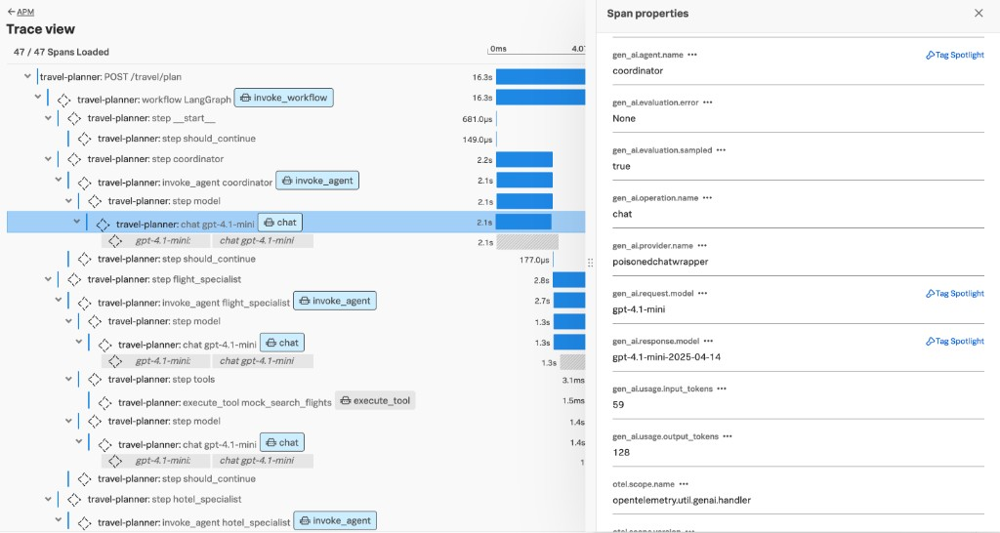
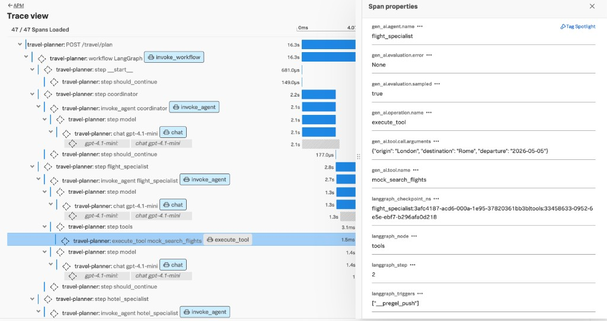
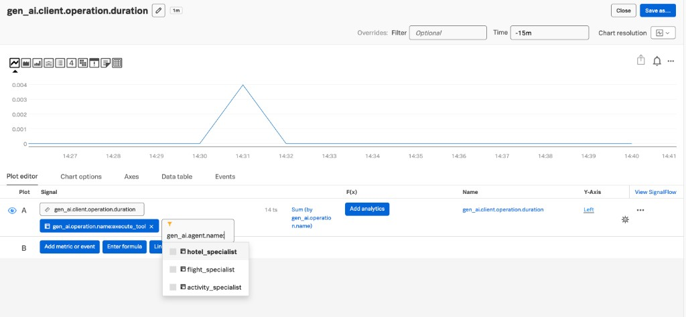
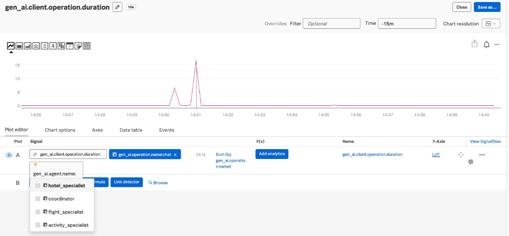

# Proposal: `gen_ai.agent.name` on GenAI child spans and client metrics

> **Intent:** Contribution draft for [open-telemetry/semantic-conventions](https://github.com/open-telemetry/semantic-conventions).  
> **Scope:** `gen_ai.agent.name` only — **`gen_ai.agent.id` is explicitly out of scope.**

---

## 1. Motivation / Problem statement

Multi-agent and orchestrated applications emit many **inference**, **embeddings**, **retrieval**, and **execute_tool** spans that share the same **`gen_ai.request.model`** or **`gen_ai.tool.name`**. Those attributes alone do not identify **which logical agent** (e.g. planner vs retriever) initiated the operation.

**Metrics** for `gen_ai.client.token.usage` and `gen_ai.client.operation.duration` are similarly hard to break down **by agent** without a standard attribute, which blocks **cost**, **latency**, and **SLO** views per agent.

---

## 2. Goals

- Standardize **`gen_ai.agent.name`** on **inference**, **embeddings**, **retrieval**, and **execute_tool** **client** spans when the operation is performed **on behalf of a named agent**.
- Add **`gen_ai.agent.name`** as a **documented** dimension on **GenAI client metrics** where it improves breakdown without mandating high cardinality.
- Keep **`gen_ai.agent.name`** as a **low-cardinality**, **logical** agent label (product/agent role), not a per-run identifier.

---

## 3. Proposed solution

### 3.1 Semantic meaning

**`gen_ai.agent.name`** on a **child** span or metric record means:

> The **logical name** of the agent **on whose behalf** this inference, embedding, retrieval, or tool execution was performed.

It **SHOULD** align with the name used when that agent is represented by an **`invoke_agent`** (or equivalent) span in the same system, when such a span exists.

### 3.2 Span convention changes (`gen-ai-spans.md`)

For each of the following sections, **add** `gen_ai.agent.name` to the span attribute table:

| Section | Span kinds / notes |
|--------|---------------------|
| Inference | e.g. `chat`, `generate_content`, `text_completion`, … |
| Embeddings | `embeddings` |
| Retrievals | `retrieval` |
| Execute tool | `execute_tool` |

**Suggested requirement level:** **Recommended** — when the instrumentation **knows** the agent name (typical for agent frameworks / wrappers). Omitted when there is **no** agent concept (raw model client).

**Documentation notes (normative guidance):**

- **MUST NOT** use this attribute for **end-user IDs**, **request IDs**, or other **unbounded** values.
- Instrumentations **SHOULD** use a **small, stable** set of names (e.g. `billing_support`, `research_agent`).

### 3.3 Metric convention changes (`gen-ai-metrics.md`)

Add **`gen_ai.agent.name`** to metric attribute tables where the operation can be tied to an agent, for example:

| Metric | Suggested requirement |
|--------|------------------------|
| `gen_ai.client.token.usage` | Recommended when available |
| `gen_ai.client.operation.duration` | Recommended when available |
| *(Optional)* `gen_ai.client.operation.time_to_first_chunk` | Recommended when available |
| *(Optional)* `gen_ai.client.operation.time_per_output_chunk` | Recommended when available |

**Guidance:** Same low-cardinality rules as spans; implementations **MAY** omit when no agent context exists.

---

## 4. Use cases / rationale

### 4.1 Spans

- **Filtering and grouping** in trace UIs without inferring parent `invoke_agent`.
- **Disambiguation** when the same **model** or **tool** is used by **different** agents.

### 4.2 Metrics

- **Token and cost** breakdown by agent.
- **Latency and error** SLOs **per agent** for the same `gen_ai.operation.name` and model.

---

## 5. Sample screenshots (Splunk Observability Cloud)

The following examples use a **travel-planner** style multi-agent app (LangGraph-style workflow with `invoke_workflow`, `invoke_agent`, `chat`, and `execute_tool` spans). They illustrate how **`gen_ai.agent.name`** on **child** spans and **client metrics** appears in **Splunk APM** and **chart builders** when using OpenTelemetry GenAI instrumentation.

### 5.1 Trace view — inference (`chat`) span

A **`chat`** span for `gpt-4.1-mini` under the **coordinator** agent shows **`gen_ai.agent.name`: `coordinator`** in span properties, alongside `gen_ai.operation.name`, token usage, and model attributes—without inferring the agent only from a parent `invoke_agent` row in the UI.

### 5.2 Trace view — `execute_tool` span

An **`execute_tool`** span (**`mock_search_flights`**) carries **`gen_ai.agent.name`: `flight_specialist`**, linking the tool execution to the agent that invoked it in the same trace.

### 5.3 Metrics — duration by agent for `execute_tool`

**`gen_ai.client.operation.duration`** can be filtered (e.g. `gen_ai.operation.name: execute_tool`) and broken down or filtered by **`gen_ai.agent.name`** (`hotel_specialist`, `flight_specialist`, `activity_specialist`, …) in the plot editor.

### 5.4 Metrics — duration by agent for `chat`

The same pattern applies to **`chat`** operations: filter on **`gen_ai.operation.name: chat`** and use **`gen_ai.agent.name`** to compare **coordinator** vs specialist agents.

---

## 6. Backward compatibility

- **Additive** only: new **recommended** (or **opt-in** for metrics, if SIG prefers) attributes/dimensions.
- Respect existing GenAI **stability and opt-in** policy for emitting **latest experimental** vs legacy behavior.

---

## 7. Open questions

1. **Nested agents:** Should the spec say **“nearest owning agent”** vs **“root workflow agent”** when multiple agents nest? (Pick one default; allow instrumentation notes.)
2. **Metrics requirement level:** **Recommended** vs **Opt-in** for `gen_ai.client.*` metrics—SIG preference for default cardinality.
3. **Streaming metrics:** Include **`gen_ai.agent.name`** on **time_to_first_chunk** / **time_per_output_chunk** in v1 of the change or follow-up PR?

---

## 8. Specification / implementation checklist

- [ ] Update **`model/`** YAML for affected span and metric definitions.
- [ ] Regenerate **`docs/gen-ai/gen-ai-spans.md`** and **`docs/gen-ai/gen-ai-metrics.md`**.
- [ ] **CHANGELOG** entry under GenAI.
- [ ] Optional: examples in **non-normative** docs showing agent-attributed chat + tool spans.

---

## 9. References

- [OpenTelemetry Semantic Conventions repository](https://github.com/open-telemetry/semantic-conventions)
- [GenAI spans](https://github.com/open-telemetry/semantic-conventions/blob/main/docs/gen-ai/gen-ai-spans.md)
- [GenAI metrics](https://github.com/open-telemetry/semantic-conventions/blob/main/docs/gen-ai/gen-ai-metrics.md)
- [Contributing](https://github.com/open-telemetry/semantic-conventions/blob/main/CONTRIBUTING.md)
