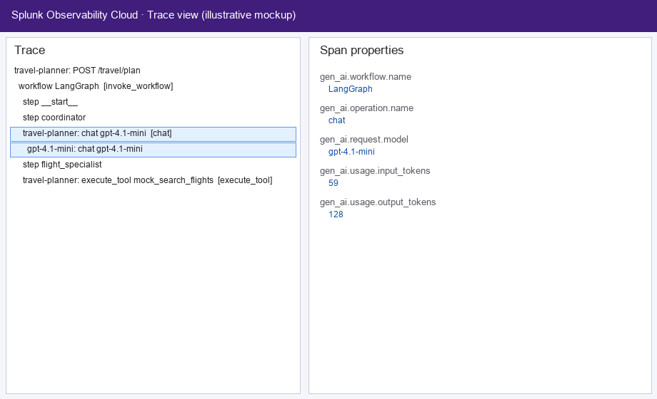
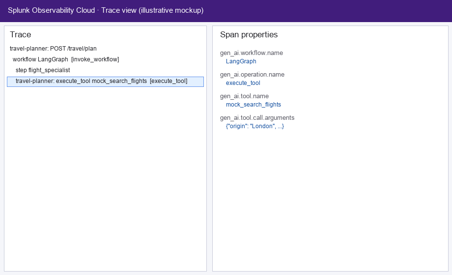
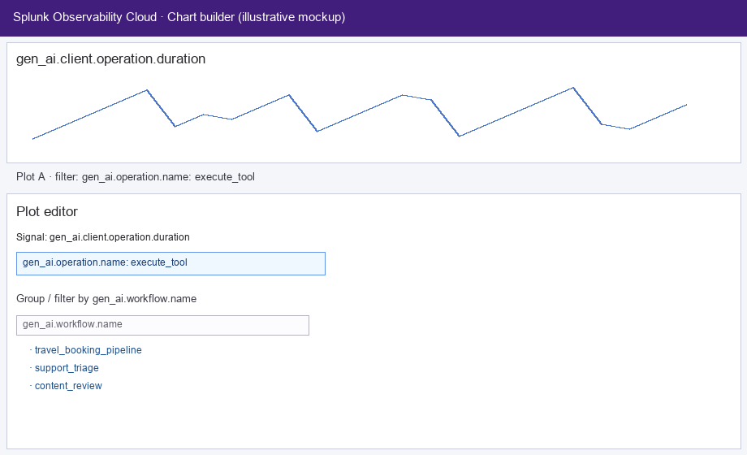
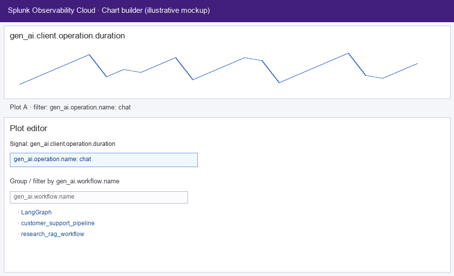

# Proposal: `gen_ai.workflow.name` on GenAI child spans and client metrics

> **Intent:** Contribution draft for [open-telemetry/semantic-conventions](https://github.com/open-telemetry/semantic-conventions).  
> **Scope:** `gen_ai.workflow.name` only — **workflow instance / id attributes are explicitly out of scope.**

---

## 1. Motivation / Problem statement

Orchestrated GenAI systems (graphs, crews, pipelines) emit many **inference**, **embeddings**, **retrieval**, and **execute_tool** spans under a single **logical workflow** (e.g. `customer_support_pipeline`, `travel_planner_graph`). Today, **`gen_ai.workflow.name`** is naturally present on **`invoke_workflow`** (or equivalent) spans, but **child** operations often only show **model**, **tool**, or **provider**, not **which pipeline** they belong to.

Operators then depend on **trace hierarchy** or custom attributes to answer:

- Which **workflow** drove this **chat** or **tool** span?
- How do **token usage** and **latency** break down **by workflow** for the same model?

Without a **standard** attribute on **child** spans and **client** metrics, backends cannot offer **portable** filters, dashboards, or SLOs **by workflow** without vendor-specific keys or parent-span joins.

---

## 2. Goals

- Standardize **`gen_ai.workflow.name`** on **inference**, **embeddings**, **retrieval**, and **execute_tool** **client** spans when the operation runs **in the context of a named workflow**.
- Add **`gen_ai.workflow.name`** as a **documented** dimension on **GenAI client metrics** (`gen_ai.client.token.usage`, `gen_ai.client.operation.duration`, and optionally streaming metrics) when workflow context is known.
- Treat the value as **low-cardinality**: a **stable logical name** for the orchestration unit (pipeline / app / graph), not a per-run id.

---

## 3. Proposed solution

### 3.1 Semantic meaning

**`gen_ai.workflow.name`** on a **child** span or metric record means:

> The **logical name** of the **workflow** (orchestration / pipeline) **within which** this inference, embedding, retrieval, or tool execution was performed.

It **SHOULD** match the value used on the **`invoke_workflow`** span (or the workflow entity) for the same logical run when such a span exists.

### 3.2 Span convention changes (`gen-ai-spans.md`)

For each of the following sections, **add** `gen_ai.workflow.name` to the span attribute table:

| Section | Notes |
|--------|--------|
| Inference | e.g. `chat`, `generate_content`, `text_completion`, … |
| Embeddings | `embeddings` |
| Retrievals | `retrieval` |
| Execute tool | `execute_tool` |

**Suggested requirement level:** **Recommended** — when the instrumentation **knows** the workflow name (e.g. from framework config, graph metadata, or explicit API). **Omitted** when there is **no** workflow context.

**Normative guidance:**

- **MUST NOT** use this attribute for **unbounded** values (raw user input, thread ids as workflow names, UUIDs per invocation).
- **SHOULD** use a **small, stable** set of names aligned with how the application names its pipelines in config or UI.

### 3.3 Metric convention changes (`gen-ai-metrics.md`)

Add **`gen_ai.workflow.name`** to metric attribute tables where the operation can be tied to a workflow, for example:

| Metric | Suggested requirement |
|--------|------------------------|
| `gen_ai.client.token.usage` | Recommended when available |
| `gen_ai.client.operation.duration` | Recommended when available |
| *(Optional)* `gen_ai.client.operation.time_to_first_chunk` | Recommended when available |
| *(Optional)* `gen_ai.client.operation.time_per_output_chunk` | Recommended when available |

**Guidance:** Omit when no workflow context exists; same **low-cardinality** rules as spans.

---

## 4. Use cases / rationale

### 4.1 Spans

- **Filter and group** child spans **by pipeline** without walking to **`invoke_workflow`**.
- **Compare** the same **model** or **tool** across **different** workflows (e.g. staging vs production pipeline name, or two products sharing one model).

### 4.2 Metrics

- **Cost and token** usage **by workflow** (which pipeline consumes the most input tokens).
- **Latency and error** SLOs **per workflow** for the same `gen_ai.operation.name` and model.

---

## 5. Sample screenshots (Splunk Observability Cloud)

This section mirrors the structure of **`agent_name.md` §5**, but for **`gen_ai.workflow.name`** on child spans and client metrics.

The images below are **illustrative mockups** (generated via `scripts/generate_workflow_splunk_mockups.py`) styled like Splunk APM and chart builder layouts. They are **not** live product screenshots; you can replace them with real **Splunk Observability Cloud** captures from your environment when available—same filenames under `images/` preserve stable links.

### 5.1 Trace view — inference (`chat`) span

A **`chat`** span for `gpt-4.1-mini` nested under a **LangGraph** workflow shows **`gen_ai.workflow.name`: `LangGraph`** in span properties, alongside `gen_ai.operation.name`, token usage, and model attributes—so the pipeline is visible on the **child** span, not only on **`invoke_workflow`**.

### 5.2 Trace view — `execute_tool` span

An **`execute_tool`** span (**`mock_search_flights`**) carries **`gen_ai.workflow.name`: `LangGraph`**, linking the tool execution to the **workflow** that owns the run.

### 5.3 Metrics — duration by workflow for `execute_tool`

**`gen_ai.client.operation.duration`** can be filtered (e.g. `gen_ai.operation.name: execute_tool`) and broken down or filtered by **`gen_ai.workflow.name`** (`travel_booking_pipeline`, `support_triage`, `content_review`, …) in the plot editor.

### 5.4 Metrics — duration by workflow for `chat`

The same pattern applies to **`chat`** operations: filter on **`gen_ai.operation.name: chat`** and use **`gen_ai.workflow.name`** to compare pipelines (e.g. **LangGraph** vs **`customer_support_pipeline`**).

---

## 6. Relationship to `gen_ai.agent.name`

When **both** apply (agent inside a workflow):

- **Both** attributes **MAY** be set on the same span or metric record: workflow = **orchestration**, agent = **logical agent** within that orchestration.
- The spec **SHOULD** state that neither replaces the other; backends **MAY** group by workflow, agent, or both.

---

## 7. Backward compatibility

- **Additive** only: new **recommended** (or **opt-in** for metrics, if SIG prefers) attributes/dimensions.
- Align with GenAI **stability / opt-in** policy for experimental conventions.

---

## 8. Open questions

1. **Nested workflows:** If a span sits inside **nested** orchestration, should instrumentation set the **innermost**, **outermost**, or **both** (outer + inner via a future convention)? Recommend **innermost** as default with a one-line note unless SIG wants **outermost** for product-level reporting.
2. **Metrics requirement level:** **Recommended** vs **Opt-in** for `gen_ai.client.*` given cardinality guidance.
3. **Streaming metrics:** Include workflow name on **time_to_first_chunk** / **time_per_output_chunk** in the first PR or a follow-up?

---

## 9. Specification / implementation checklist

- [ ] Update **`model/`** YAML for affected span and metric definitions.
- [ ] Regenerate **`docs/gen-ai/gen-ai-spans.md`** and **`docs/gen-ai/gen-ai-metrics.md`**.
- [ ] **CHANGELOG** entry under GenAI.
- [ ] Optional: non-normative example (LangGraph / multi-step pipeline) showing workflow + agent on a **chat** and **execute_tool** span.

---

## 10. References

- [OpenTelemetry Semantic Conventions](https://github.com/open-telemetry/semantic-conventions)
- [GenAI spans](https://github.com/open-telemetry/semantic-conventions/blob/main/docs/gen-ai/gen-ai-spans.md)
- [GenAI metrics](https://github.com/open-telemetry/semantic-conventions/blob/main/docs/gen-ai/gen-ai-metrics.md)
- [Contributing](https://github.com/open-telemetry/semantic-conventions/blob/main/CONTRIBUTING.md)
